# C51 (Categorical DQN with 51 atoms) reproduction

This reproduction script trains the C51 (Categorical DQN with 51 atoms) algorithm proposed by M. G. Bellemare, et al. in the paper: [A Distributional Perspective on Reinforcement Learning](https://arxiv.org/abs/1707.06887).

## How to run the reproduction script

To run the reproduction script do

```sh
$ python c51_reproduction.py <options>
```

If you omit options, the script will run on BreakoutNoFrameskip-v4 environment with gpu id 0.

You can change the training environment and gpu as follows

```sh
$ python c51_reproduction.py --env <env_name> --gpu <gpu_id>
```

```sh
# Example1: run the script on cpu and train the agent with Pong:
$ python c51_reproduction.py --env PongNoFrameskip-v4 --gpu -1
# Example2: run the script on gpu 1 and train the agent with SpaceInvaders:
$ python c51_reproduction.py --env SpaceInvadersNoFrameskip-v4 --gpu 1
```

To check all available options type:

```sh
$ python c51_reproduction.py --help
```

To check the trained result do

```sh
$ python c51_reproduction.py --showcase --snapshot-dir <snapshot_dir> --render
```

```sh
# Example:
$ python c51_reproduction.py --showcase --snapshot-dir ./BreakoutNoFrameskip-v4/seed-1/iteration-250000/ --render
```

## Evaluation procedure

We tested our implementation with 55 Atari games also used in the [original paper](https://arxiv.org/pdf/1707.06887.pdf) using 3 differnt initial random seeds:

We evaluated the algorithm in following settings.

* In every 1M frames (250K steps), the mean reward is evaluated using the Q-Network parameter at that timestep. 
* The evaluation step lasts for 500K frames (125K steps) but the last episode that exceeeds 125K timesteps is not used for evaluation.
* epsilon is set to 0.001 (not greedy).

Mean evaluation score is the mean score among 3 seeds at each iteration.

## Result

Our reproduction results scored higher on 27 out of 55 games and lower on 25 out of 55 games than the original paper. 3 games scored tie.

|Env|nnabla_rl best mean score|Reported score|
|:---|:---:|:---:|
|AlienNoFrameskip-v4|**4254.503+/-2372.336**|3166|
|AmidarNoFrameskip-v4|1056.854+/-249.495|**1735**|
|AssaultNoFrameskip-v4|**7805.29+/-3486.767**|7203|
|AsterixNoFrameskip-v4|**443754.286+/-275731.902**|406211|
|AsteroidsNoFrameskip-v4|1073.42+/-488.45|**1516**|
|AtlantisNoFrameskip-v4|**2843866.667+/-62464.514**|841075|
|BankHeistNoFrameskip-v4|**1273.71+/-58.251**|976|
|BattleZoneNoFrameskip-v4|**35711.111+/-17030.198**|28742|
|BeamRiderNoFrameskip-v4|**16576.81+/-7791.914**|14074|
|BerzerkNoFrameskip-v4|1072.0+/-328.167|**1645**|
|BowlingNoFrameskip-v4|68.342+/-16.81|**81.8**|
|BoxingNoFrameskip-v4|**99.473+/-2.269**|97.8|
|BreakoutNoFrameskip-v4|563.0+/-161.581|**748**|
|CentipedeNoFrameskip-v4|9572.421+/-5250.178|**9646**|
|ChopperCommandNoFrameskip-v4|1919.231+/-761.082|**15600**|
|CrazyClimberNoFrameskip-v4|166264.706+/-33116.402|**179877**|
|DemonAttackNoFrameskip-v4|**428375.0+/-6283.805**|130955|
|DoubleDunkNoFrameskip-v4|**13.072+/-12.514**|2.5|
|EnduroNoFrameskip-v4|3155.5+/-1284.789|**3454**|
|FishingDerbyNoFrameskip-v4|**19.836+/-13.405**|8.9|
|FreewayNoFrameskip-v4|**33.989+/-0.104**|**33.9**|
|FrostBiteNoFrameskip-v4|**6104.009+/-1802.464**|3965|
|GopherNoFrameskip-v4|20380.615+/-15930.431|**33641**|
|GravitarNoFrameskip-v4|**641.683+/-251.481**|440|
|HeroNoFrameskip-v4|38627.549+/-1177.709|**38874**|
|IceHockeyNoFrameskip-v4|**-3.333+/-3.066**|-3.5|
|JamesbondNoFrameskip-v4|1750.843+/-2375.214|**81909**|
|KangarooNoFrameskip-v4|**13361.111+/-2522.485**|12853|
|KrullNoFrameskip-v4|9210.726+/-845.084|**9735**|
|KungFuMasterNoFrameskip-v4|40088.506+/-9962.855|**48192**|
|MontezumaRevengeNoFrameskip-v4|**133.333+/-188.562**|0.0|
|MsPacmanNoFrameskip-v4|**4065.853+/-1689.254**|3415|
|NameThisGameNoFrameskip-v4|**14202.593+/-1838.596**|12542|
|PhoenixNoFrameskip-v4|**28034.286+/-10729.892**|17490|
|PitfallNoFrameskip-v4|**0.0**|**0.0**|
|PongNoFrameskip-v4|**20.991+/-0.096**|**20.9**|
|PrivateEyeNoFrameskip-v4|11982.572+/-4550.979|**15095**|
|QbertNoFrameskip-v4|**26328.664+/-1934.616**|23784|
|RiverRaidNoFrameskip-v4|**18665.796+/-3464.014**|17322|
|RoadRunnerNoFrameskip-v4|**64643.571+/-7820.378**|55839|
|RobotankNoFrameskip-v4|**55.306+/-7.584**|52.3|
|SeaquestNoFrameskip-v4|**349329.167+/-242798.419**|266434|
|SkiingNoFrameskip-v4|-14716.707+/-6828.205|**-13901**|
|SolarisNoFrameskip-v4|1884.286+/-1615.208|**8342**|
|SpaceInvadersNoFrameskip-v4|**15407.162+/-18688.914**|5747|
|StarGunnerNoFrameskip-v4|**51339.024+/-4274.763**|49095|
|TennisNoFrameskip-v4|22.657+/-1.274|**32.1**|
|TimePilotNoFrameskip-v4|7123.529+/-1580.134|**8329**|
|TutankhamNoFrameskip-v4|**283.333+/-16.357**|280|
|UpNDownNoFrameskip-v4|11226.486+/-5633.323|**15612**|
|VentureNoFrameskip-v4|1423.563+/-412.543|**1520**|
|VideoPinballNoFrameskip-v4|798480.0+/-48797.712|**949604**|
|WizardOfWorNoFrameskip-v4|3348.855+/-1794.664|**9300**|
|YarsRevengeNoFrameskip-v4|31652.309+/-15084.316|**35050**|
|ZaxxonNoFrameskip-v4|9358.519+/-2318.537|**10513**|

## Learning curves

|||||
|:---:|:---:|:---:|:---:|
|Alien|Amidar|Assault|Asterix|
|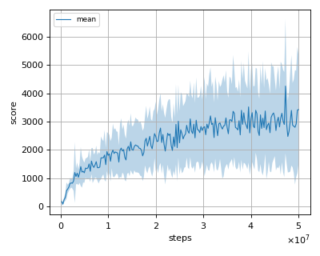||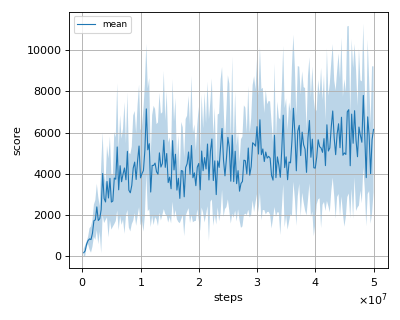|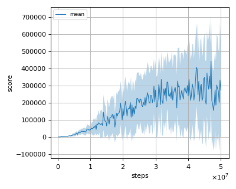|
|Asteroids|Atlantis|BankHeist|BattleZone|
||||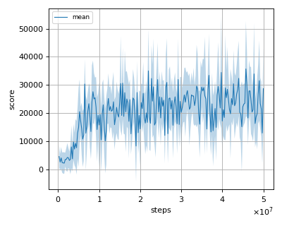|
|BeamRider|Berzerk|Bowling|Boxing|
||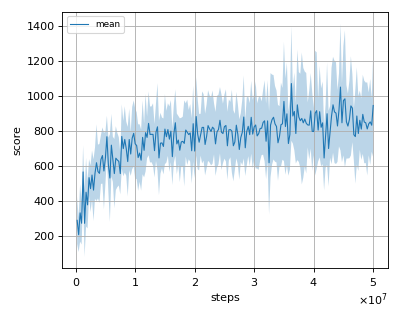|||
|Breakout|Centipede|ChopperCommand|CrazyClimber|
|||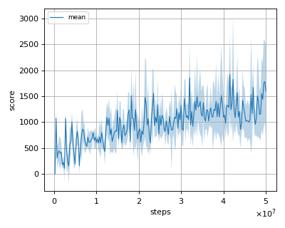|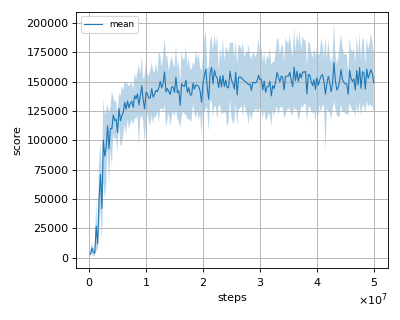|
|DemonAttack|DoubleDunk|Enduro|FishingDerby|
|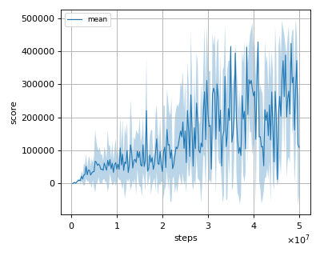|||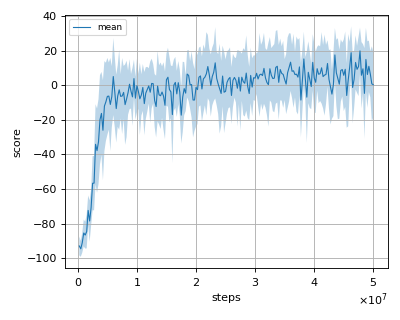|
|Freeway|Frostbite|Gopher|Gravitar|
||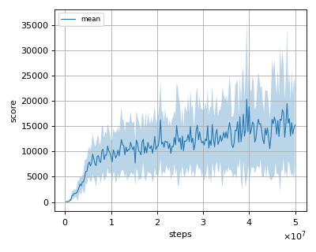||
|Hero|IceHockey|Jamesbond|Kangaroo|
|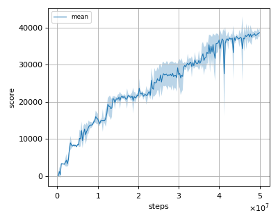|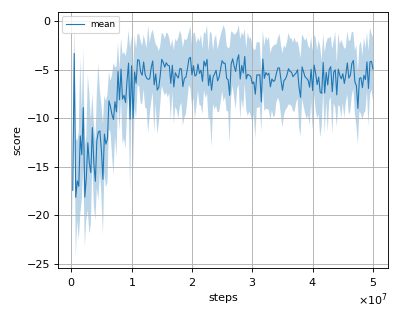|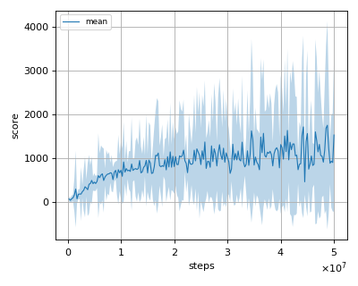|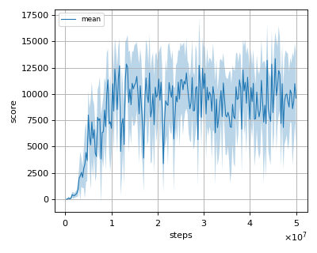|
|Krull|KungFuMaster|MontezumaRevenge|MsPacman|NameThisGame|
||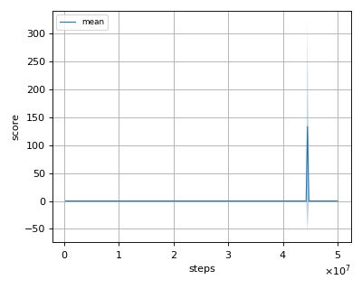|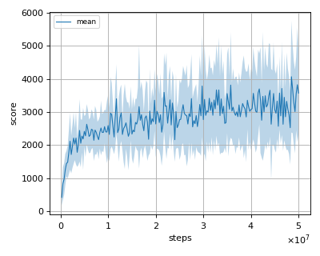|
|NameThisGame|Phoenix|Pitfall|Pong|
||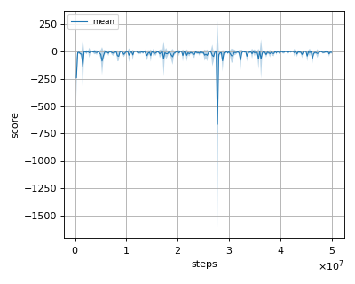|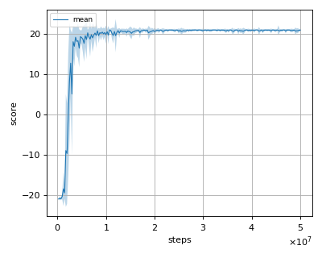|
|PrivateEye|QBert|Riverraid|RoadRunner|
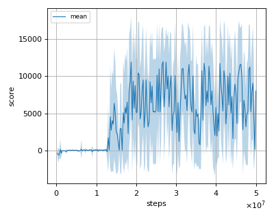||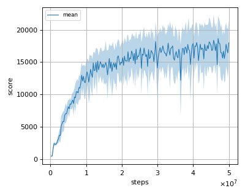||
|Robotank|Seaquest|Skiing|Solaris|
|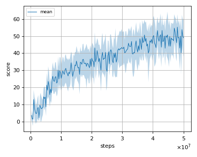|||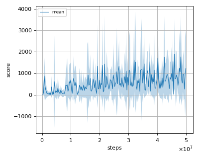|
|SpaceInvaders|StarGunner|Tennis|TimePilot|
||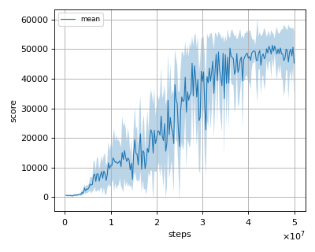|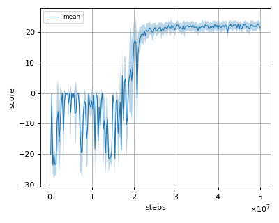||
|Tutankham|UpNDown|Venture|VideoPinball|
|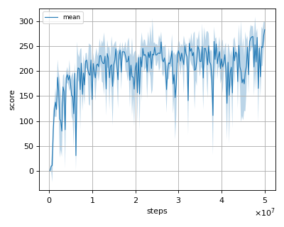|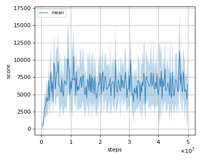|||
|WizardOfWor|YarsRevenge|Zaxxon||
|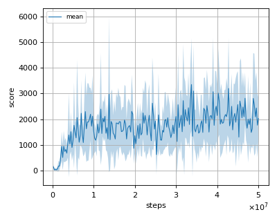|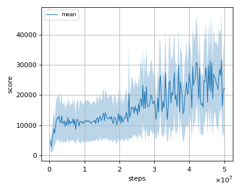|||
