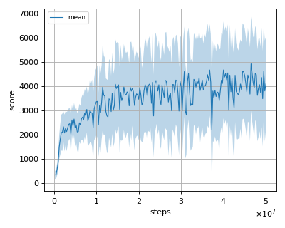
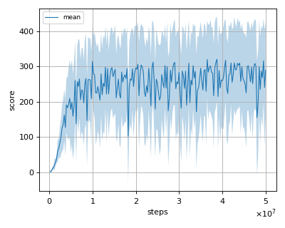
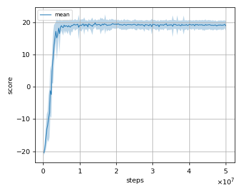
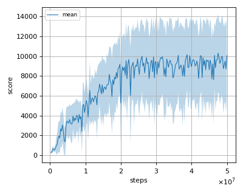
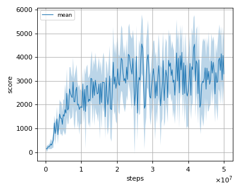

# Double DQN reproduction

This reproduction script trains the Deep Q-Network with double q-learning (DDQN) algorithm proposed by H. van Hasselt, et al in the paper: [Deep Reinforcement Learning with Double Q-learning](https://arxiv.org/abs/1509.06461).

## Prerequisite

Install gym[atari] via pip and install atari ROMS following [here](https://github.com/mgbellemare/Arcade-Learning-Environment/tree/master/examples/python-rom-package).

```
$ pip install gym[atari]
```

## How to run the reproduction script

To run the reproduction script do

```sh
$ python ddqn_reproduction.py <options>
```

If you omit options, the script will run on BreakoutNoFrameskip-v4 environment with gpu id 0.

You can change the training environment and gpu as follows

```sh
$ python ddqn_reproduction.py --env <env_name> --gpu <gpu_id>
```

```sh
# Example1: run the script on cpu and train the agent with Pong:
$ python ddqn_reproduction.py --env PongNoFrameskip-v4 --gpu -1
# Example2: run the script on gpu 1 and train the agent with SpaceInvaders:
$ python ddqn_reproduction.py --env SpaceInvadersNoFrameskip-v4 --gpu 1
```

To check all available options type:

```sh
$ python ddqn_reproduction.py --help
```

To check the trained result do

```sh
$ python ddqn_reproduction.py --showcase --snapshot-dir <snapshot_dir> --render
```

```sh
# Example:
$ python ddqn_reproduction.py --showcase --snapshot-dir ./BreakoutNoFrameskip-v4/seed-1/iteration-250000/ --render
```

## Evaluation procedure
We tested our implementation with 5 Atari games also used in the [original paper](https://arxiv.org/abs/1509.06461).  

Following Atari games was tested with 3 seeds:

- Asterix
- BreakOut
- Pong
- Qbert
- Seaquest

## Evaluation

We evaluated the algorithm in following settings.

* In every 1M frames (250K steps), the mean reward is evaluated using the Q-Network parameter at that timestep. 
* The evaluation step lasts for 500K frames (125K steps) but the last episode that exceeeds 125K timesteps is not used for evaluation.
* epsilon is set to 0.05 (not greedy).

All seeds results are combined and the mean of the score is calculated from them.

## Result

|Env|nnabla_rl DDQN best mean score|nnabla_rl DQN best mean score|Reported score|
|:---|:---:|:---:|:---:|
|AsterixNoFrameskip-v4|4935.586+/-1941.007|4151.902+/-1878.659|15150.00|
|BreakoutNoFrameskip-v4|320.226+/-118.243|328.513+/-113.669|375.00|
|PongNoFrameskip-v4|19.891+/-1.179|19.976+/-1.071|21.00|
|QbertNoFrameskip-v4|10312.859+/-3915.711|7798.325+/-1958.599|14875.00|
|SeaquestFrameskip-v4|4557.233+/-1240.709|3831.481+/-1842.871|7995.00|

## Learning curves

### Asterix



### Breakout



### Pong



### Qbert



### Seaquest

