# DRQN (Deep Recurrent Q-learning Network) reproduction

This reproduction script trains the DRQN (Deep Recurrent Q-learning Network) algorithm
proposed by M. Hausknecht, et al. in the paper: 
[Deep Recurrent Q-Learning for Partially Observable MDPs](https://arxiv.org/pdf/1507.06527.pdf)

## Prerequisite

Install gym[atari] via pip and install atari ROMS following [here](https://github.com/mgbellemare/Arcade-Learning-Environment/tree/master/examples/python-rom-package).

```
$ pip install gym[atari]
```

## How to run the reproduction script

To run the reproduction script do

```sh
$ python drqn_reproduction.py <options>
```

If you omit options, the script will run on BreakoutNoFrameskip-v4 environment with gpu id 0.

To train the DRQN agent with flicker frames use --flicker option.
Each frame will be obscured with probability 0.5.

```sh
$ python drqn_reproduction.py --flicker
```

You can change the training environment and gpu as follows

```sh
$ python drqn_reproduction.py --env <env_name> --gpu <gpu_id>
```

```sh
# Example1: run the script on cpu and train the agent with Pong:
$ python drqn_reproduction.py --env PongNoFrameskip-v4 --gpu -1
# Example2: run the script on gpu 1 and train the agent with SpaceInvaders:
$ python drqn_reproduction.py --env SpaceInvadersNoFrameskip-v4 --gpu 1
```

To check all available options type:

```sh
$ python drqn_reproduction.py --help
```

To check the trained result do

```sh
$ python drqn_reproduction.py --showcase --snapshot-dir <snapshot_dir> --render
```

```sh
# Example:
$ python drqn_reproduction.py --showcase --snapshot-dir ./BreakoutNoFrameskip-v4/seed-1/iteration-250000/ --render
```

## Evaluation procedure

We tested our implementation with 10 Atari games also used in the [original paper](https://arxiv.org/pdf/1507.06527.pdf) using 3 different initial random seeds:
As in the paper, we evaluated the performance of trained network every 50000 iterations by playing 10 episodes. The score is the average among 3 seeds.

## Result

### Result on standard Atari setting.

|Env|nnabla_rl best mean score|Reported score|
|:---|:---:|:---:|
|AsteroidsNoFrameskip-v4|**1258+/-576**|1020+/-312|
|BeamRiderNoFrameskip-v4|**4434+/-1897**|3269+/-1167|
|BowlingNoFrameskip-v4|50+/-19|**62+/-5.9**|
|CentipedeNoFrameskip-v4|**4497+/-1671**|3534+/-1601|
|ChopperCommandNoFrameskip-v4|Coming soon|**2070+/-1460**|
|DoubleDunkNoFrameskip-v4|-9.5+/-5.1|**-2+/-7.8**|
|FrostbiteNoFrameskip-v4|552+/-565|**2875+/-535**|
|IceHockeyNoFrameskip-v4|-6.7+/-2.3|**-4.4+/-1.6**|
|MsPacmanRiderNoFrameskip-v4|1652+/-806|**2048+/-653**|
|PongNoFrameskip-v4|19.7+/-1.2|N/A|

### Learning curves

||||||
|:---:|:---:|:---:|:---:|:---:|
|Asteroids|BeamRider|Bowling|Centipede|ChopperCommand|
|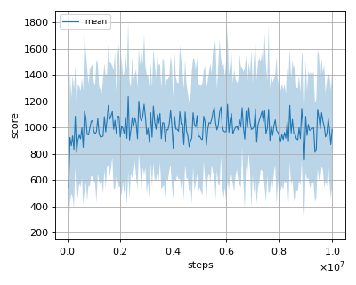|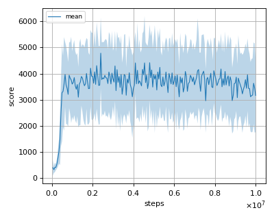|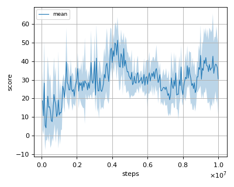|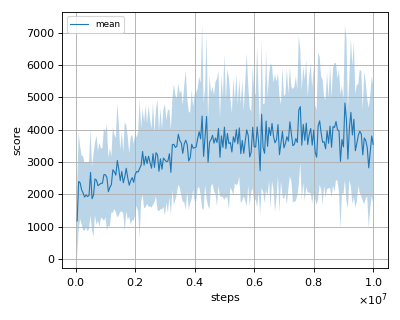|Coming soon|
|DoubleDunk|Frostbite|IceHockey|MsPacman|Pong|
||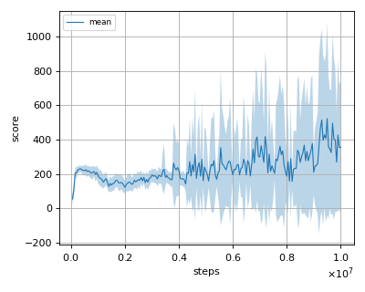|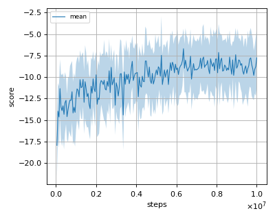|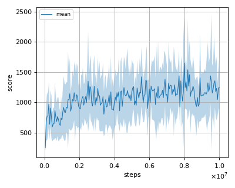|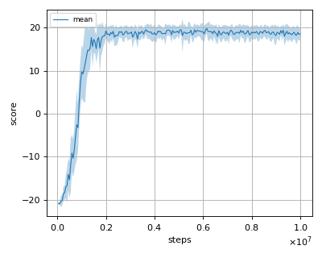|

### Result on Atari games with flicker.

|Env|nnabla_rl best mean score|Reported score|
|:---|:---:|:---:|
|AsteroidsNoFrameskip-v4|**1070+/-385**|1032+/-410|
|BeamRiderNoFrameskip-v4|**874+/-278**|618+/-115|
|BowlingNoFrameskip-v4|42.0+/-20.5|**65.5+/-13**|
|CentipedeNoFrameskip-v4|3408+/-1188|**4319.2+/-4378**|
|ChopperCommandNoFrameskip-v4|Coming soon|**1330+/-294**|
|DoubleDunkNoFrameskip-v4|**-12.9+/-4.3**|-14+/-.25|
|FrostbiteNoFrameskip-v4|217+/-26|**414+/-494**|
|IceHockeyNoFrameskip-v4|-6.8+/-3.2|**-5.4+/-2.7**|
|MsPacmanRiderNoFrameskip-v4|1598+/-713|**1739+/-942**|
|PongNoFrameskip-v4|6.1+/-5.4|**12.1+/-2.2**|

### Learning curves

||||||
|:---:|:---:|:---:|:---:|:---:|
|Asteroids|BeamRider|Bowling|Centipede|ChopperCommand|
|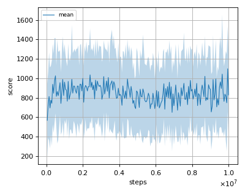|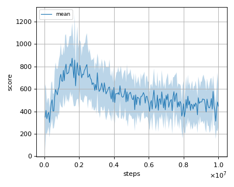|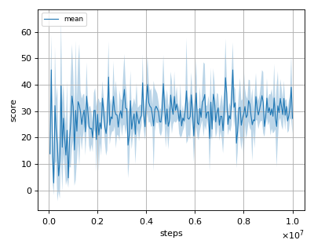|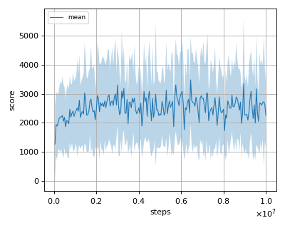|Coming soon|
|DoubleDunk|Frostbite|IceHockey|MsPacman|Pong|
|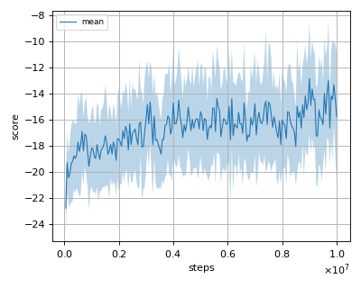|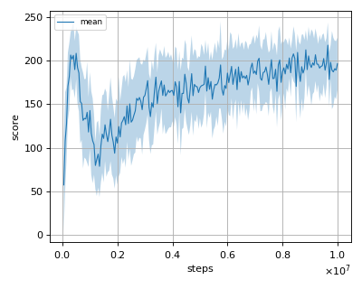|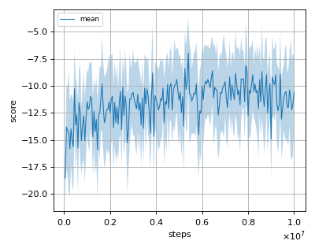|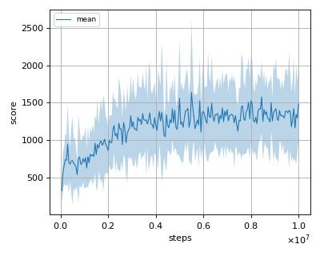|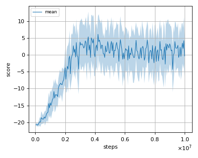|

