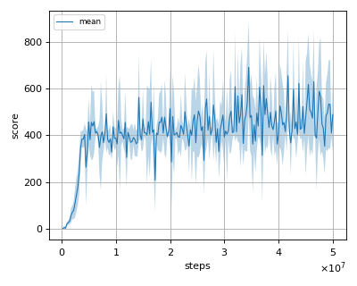

# IQN (Implicit Quantile Networks) reproduction

This reproduction script trains the IQN (Implicit Quantile Networks) algorithm proposed by W. Dabney et al. in the paper: [Implicit Quantile Networks for Distributional Reinforcement Learning](https://arxiv.org/pdf/1806.06923.pdf).

## Prerequisite

Install gym[atari] via pip and install atari ROMS following [here](https://github.com/mgbellemare/Arcade-Learning-Environment/tree/master/examples/python-rom-package).

```
$ pip install gym[atari]
```

## How to run the reproduction script

To run the reproduction script do

```sh
$ python iqn_reproduction.py <options>
```

If you omit options, the script will run on BreakoutNoFrameskip-v4 environment with gpu id 0.

You can change the training environment and gpu as follows

```sh
$ python iqn_reproduction.py --env <env_name> --gpu <gpu_id>
```

```sh
# Example1: run the script on cpu and train the agent with Pong:
$ python iqn_reproduction.py --env PongNoFrameskip-v4 --gpu -1
# Example2: run the script on gpu 1 and train the agent with SpaceInvaders:
$ python iqn_reproduction.py --env SpaceInvadersNoFrameskip-v4 --gpu 1
```

To check all available options type:

```sh
$ python iqn_reproduction.py --help
```

To check the trained result do

```sh
$ python iqn_reproduction.py --showcase --snapshot-dir <snapshot_dir> --render
```

```sh
# Example:
$ python iqn_reproduction.py --showcase --snapshot-dir ./BreakoutNoFrameskip-v4/seed-1/iteration-250000/ --render
```

## Evaluation

We tested our implementation with 5 Atari games also used in the [original paper](https://arxiv.org/pdf/1806.06923.pdf)
with 3 different initial random seeds:

- Asterix
- BreakOut
- Pong
- Qbert
- Seaquest

## Evaluation

We evaluated the algorithm in following settings.

* In every 1M frames (250K steps), the mean reward is evaluated using the Q-Network parameter at that timestep.
* The evaluation step lasts for 500K frames (125K steps) but the last episode that exceeeds 125K timesteps is not used for evaluation.
* epsilon is set to 0.001 (not greedy).

Mean evaluation score is the mean score among 3 seeds at each iteration.

## Result

|Env|nnabla_rl best mean score|Reported score|
|:---|:---:|:---:|
|AsterixNoFrameskip-v4|426228.889+/-221616.644|342016|
|BreakoutNoFrameskip-v4|691.667+/-198.017|734|
|PongNoFrameskip-v4|20.991+/-0.092|21.0|
|QbertNoFrameskip-v4|25388.993+/-2696.279|25750|
|SeaquestFrameskip-v4|35917.778+/-20879.541|30140|

## Learning curves

### Asterix


### Breakout



### Pong


### Qbert


### Seaquest


