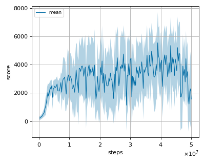

# Option Critic Architecture reproduction

This reproduction script trains the Option Critic Architecture algorithm proposed by Pierre-Luc Bacon, et al. in the paper: [The Option-Critic Architecture](https://arxiv.org/abs/1609.05140).

## Prerequisite

Install gym[atari] via pip and install atari ROMS following [here](https://github.com/mgbellemare/Arcade-Learning-Environment/tree/master/examples/python-rom-package).

```
$ pip install gym[atari]
```

## How to run the reproduction script

To run the reproduction script do

```sh
$ python option_critic_reproduction.py <options>
```

If you omit options, the script will run on SeaquestNoFrameskip-v4 environment with gpu id 0.

You can change the training environment and gpu as follows

```sh
$ python option_critic_reproduction.py --env <env_name> --gpu <gpu_id>
```

```sh
# Example1: run the script on cpu and train the agent with Asterix:
$ python option_critic_reproduction.py --env AsterixNoFrameskip-v4 --gpu -1
# Example2: run the script on gpu 1 and train the agent with MsPacman:
$ python option_critic_reproduction.py --env MsPacmanNoFrameskip-v4 --gpu 1
```

To check all available options type:

```sh
$ python option_critic_reproduction.py --help
```

To check the trained result do

```sh
$ python option_critic_reproduction.py --showcase --snapshot-dir <snapshot_dir> --render
```

```sh
# Example:
$ python option_critic_reproduction.py --showcase --snapshot-dir ./AsterixNoFrameskip-v4/seed-1/iteration-250000/ --render
```

## Evaluation

We tested our implementation with 3 Atari games also used in the [original paper](https://arxiv.org/pdf/1710.02298.pdf) using 3 different initial random seeds:

- Asterix
- Ms. Pacman
- Seaquest
- Zaxxon

We evaluated the algorithm in following settings.

* In every 1M frames (250K steps), the mean reward is evaluated using the Q-Network parameter at that timestep.
* The evaluation step lasts for 500K frames (125K steps) but the last episode that exceeeds 125K timesteps is not used for evaluation.
* Environment's timelimit was set to 108k frames (30 min).

Mean evaluation score is the mean score among 3 seeds.

We have found that the offset value impacts the score, and we are currently investigating this issue.

## Result

Reported score is rough estimate from the Figure 8 of the [option critic paper](https://arxiv.org/pdf/1609.05140).
In the figure, 1 epoch corresponds to 250,000 steps. Refer to the [author's code](https://github.com/jeanharb/option_critic/blob/5d6c81a650a8f452bc8ad3250f1f211d317fde8c/train_q.py#L14) for further details.

For comparison, the best mean scores from nnabla_rl's DQN implementation and the results from the author’s PhD thesis are also included.

From our results, we're investigating this problem.

|Env|nnabla_rl best mean score|nnabla_rl best mean score (seed)|Reported score|Author’s PhD thesis score|nnabla_rl DQN score|
|:---|:---:|:---:|:---:|:---:|:---:|
|AsterixNoFrameskip-v4|**5556.762+/-2161.242**|**6874.712+/-1517.274**|~8000|7064.3|4151.902+/-1878.659|
|Ms. PacmanNoFrameskip-v4|**2021.775+/-548.348**|**2288.750+/-683.210**|~2300|2226.4|2586.658+/-800.127|
|SeaquestNoFrameskip-v4|**2975.965+/-1148.582**|**4812.955+/-1445.006**|~9000|4644.4|3831.481+/-1842.871|
|ZaxxonNoFrameskip-v4|**3628.293+/-1645.564**|**5420.339+/-1658.647**|~7000|4081.8|2969.154+/-1434.765|

The `nnabla_rl best mean score` is calculated by integrating all the results from each seed, while the `nnabla_rl best mean score (seed)` is computed from the results of each individual seed.

## Learning curves

### Asterix



### Ms. Pacman


### Seaquest


### Zaxxon


