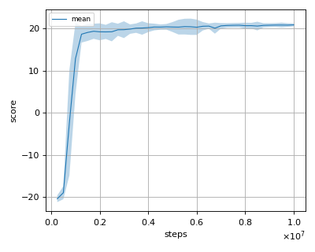
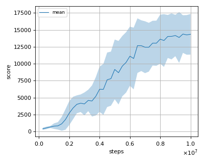

# PPO (Proximal Policy Optimization) reproduction

This reproduction script trains the PPO (Proximal Policy Optimization) algorithm proposed by J. Schulman et al. in the paper: [Proximal Policy Optimization Algorithms](https://arxiv.org/abs/1707.06347).

## Prerequisite

Install gym[atari] via pip and install atari ROMS following [here](https://github.com/mgbellemare/Arcade-Learning-Environment/tree/master/examples/python-rom-package).

```
$ pip install gym[atari]
```

## How to run the reproduction script

To run the reproduction script do

```sh
$ python ppo_reproduction.py <options>
```

If you omit options, the script will run on BreakoutNoFrameskip-v4 environment with gpu id 0.

You can change the training environment and gpu as follows

```sh
$ python ppo_reproduction.py --env <env_name> --gpu <gpu_id>
```

```sh
# Example1: run the script on cpu and train the agent with Pong:
$ python ppo_reproduction.py --env PongNoFrameskip-v4 --gpu -1
# Example2: run the script on gpu 1 and train the agent with SpaceInvaders:
$ python ppo_reproduction.py --env SpaceInvadersNoFrameskip-v4 --gpu 1
```

To check all available options type:

```sh
$ python ppo_reproduction.py --help
```

To check the trained result do

```sh
$ python ppo_reproduction.py --showcase --snapshot-dir <snapshot_dir> --render
```

```sh
# Example:
$ python ppo_reproduction.py --showcase --snapshot-dir ./BreakoutNoFrameskip-v4/seed-1/iteration-250000/ --render
```

## Evaluation

We tested our implementation with 5 Atari games also used in the [original paper](https://arxiv.org/abs/1707.06347) with 3 different initial random seeds:

- Asterix
- BreakOut
- Pong
- Qbert
- Seaquest

We evaluated the algorithm in following settings.

* Every 1M frames (250K steps), the mean reward is evaluated using the policy at that timestep. 
* The evaluation step lasts for 500K frames (125K steps) but the last episode that exceeeds 125K timesteps is not used for evaluation.
* Each action is sampled from the learned policy's action distribution.

Below score is the mean score among 3 seeds.

## Result

|Env|nnabla_rl best mean score|Reported score|
|:---|:---:|:---:|
|AsterixNoFrameskip-v4|**5871.7+/-2619.5**|4532.5|
|BreakoutNoFrameskip-v4|**365.5+/-86.3**|274.8|
|PongNoFrameskip-v4|**20.9+/-0.3**|20.7|
|QbertNoFrameskip-v4|**14373.3+/-2776.2**|14293.3|
|SeaquestFrameskip-v4|**1501.9+/-415.6**|1204.5|

## Learning curves

### Asterix


### Breakout


### Pong



### Qbert



### Seaquest

