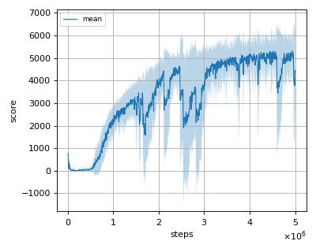
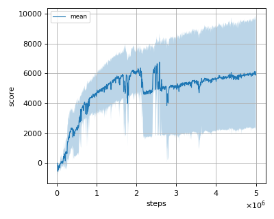
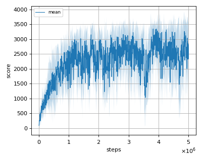
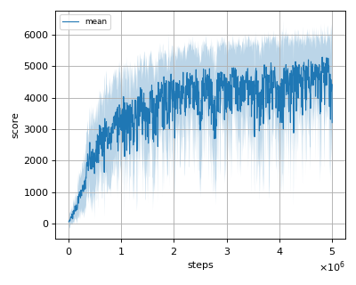

# DEMMESAC (DisEntangled Max-Min Entropy Soft Actor Critic) reproduction

This reproduction script trains the DEMME-SAC (DisEntangled Max-Min Entropy Soft Actor Critic) algorithm proposed by 
S. Han, et al. in the paper: [A Max-Min Entropy Framework for Reinforcement Learning](https://arxiv.org/abs/2106.10517)

## Prerequisites

Install [delayed mujoco environment](../environment).

```sh
$ cd ../environment
$ pip install -e .
```

## How to run the reproduction script

To run the reproduction script do

```sh
$ python demme_sac_reproduction.py <options>
```

If you omit options, the script will run on DelayedAnt-v1 environment with gpu id 0.

You can change the training environment and gpu as follows

```sh
$ python demme_sac_reproduction.py --env <env_name> --gpu <gpu_id>
```

```sh
# Example1: run the script on cpu and train the agent with DelayedHalfCheetah:
$ python demme_sac_reproduction.py --env DelayedHalfCheetah-v1 --gpu -1
# Example2: run the script on gpu 1 and train the agent with DelayedWalker2d:
$ python demme_sac_reproduction.py --env DelayedWalker2d-v1 --gpu 1
```

To check all available options type:

```sh
$ python demme_sac_reproduction.py --help
```

To check the trained result do

```sh
$ python demme_sac_reproduction.py --showcase --snapshot-dir <snapshot_dir> --render
```

```sh
# Example:
$ python demme_sac_reproduction.py --showcase --snapshot-dir ./DelayedAnt-v1/seed-1/iteration-10000/ --render
```

## Evaluation

We tested our implementation with 4 Delayed MuJoCo environments as in the [demme sac paper](https://arxiv.org/abs/2106.10517) using 5 different initial random seeds:

- DelayedAnt-v1
- DelayedHalfCheetah-v1
- DelayedHopper-v1
- DelayedWalker2d-v1

## Result

|Env|nnabla_rl best mean score|Reported score|
|:---|:---:|:---:|
|DelayedAnt-v1|5316.285+/-342.38|4851.64+/-830.88|
|DelayedHalfCheetah-v1|6756.73+/-1688.58|8451.20+/-1375.27|
|DelayedHopper-v1|3342.26+/-147.97|3435.28+/-39.55|
|DelayedWalker2d-v1|5288.54+/-514.09|5274.89+/-186.35|

## Learning curves

### DelayedAnt-v1



### DelayedHalfCheetah-v1



### DelayedHopper-v1



### DelayedWalker2d-v1


