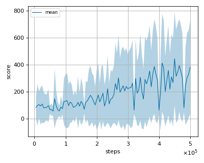
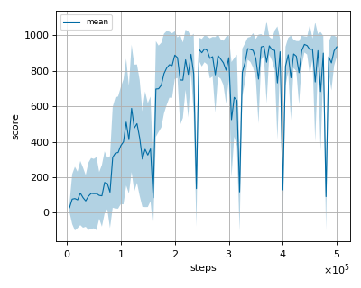

# SRSAC (Scaled-by-Resetting Soft Actor Critic) reproduction

This reproduction script trains the SRSAC (Scaled-by-Resetting Soft Actor Critic) algorithm proposed by P. D'Oro et al. 
in the paper: [SAMPLE-EFFICIENT REINFORCEMENT LEARNING BY BREAKING THE REPLAY RATIO BARRIER](https://openreview.net/pdf?id=OpC-9aBBVJe).

## Prerequisites

Install dm_control. See [this page for the detailed instruction](https://github.com/google-deepmind/dm_control).

```sh
$ pip install dm_control
```

### Optional: if you want to compute perfomance metrics (IQM/Median/Mean) using our script. 

Install [rliable](https://github.com/google-research/rliable).

```sh
$ pip install rliable
```

## How to run the reproduction script

To run the reproduction script do

```sh
$ python srsac_reproduction.py <options>
```

If you omit options, the script will run on acrobot-swingup environment with gpu id 0.

You can change the training environment and gpu as follows

```sh
$ python srsac_reproduction.py --env <env_name> --gpu <gpu_id>
```

```sh
# Example1: run the script on cpu and train the agent with cheetah-run:
$ python srsac_reproduction.py --env cheetah-run --gpu -1
# Example2: run the script on gpu 1 and train the agent with swimmer-swimmer6:
$ python srsac_reproduction.py --env swimmer-swimmer6 --gpu 1
```

To check all available options type:

```sh
$ python srsac_reproduction.py --help
```

To check the trained result do

```sh
$ python srsac_reproduction.py --showcase --snapshot-dir <snapshot_dir> --render
```

```sh
# Example:
$ python srsac_reproduction.py --showcase --snapshot-dir ./acrobot-swingup/seed-1/iteration-10000/ --render
```

## Evaluation

We tested our implementation with the following DMC15-500k environments using 3 different initial random seeds:

- acrobot-swingup 
- cheetah-run
- finger-turn_hard
- fish-swim
- hopper-hop
- hopper-stand
- humanoid-run
- humanoid-stand
- humanoid-walk
- pendulum-swingup
- quadrupted-run
- quadrupted-walk
- reacher-hard
- swimmer-swimmer6
- walker-run

## Result

## Mean-variance

|Env|nnabla_rl best mean score|Reported score|
|:---|:---:|:---:|
|acrobot-swingup|175.385+/-202.934|~100|
|cheetah-run|900.253+/-3.186|~750|
|finger-turn_hard|971.233+/-29.475|~950|
|fish-swim|445.026+/-346.014|~600|
|hopper-hop|411.447+/-89.681|~420|
|hopper-stand|948.083/-13.763|~950|
|humanoid-run|110.774+/-7.634|~200|
|humanoid-stand|605.716+/-139.385|~800|
|humanoid-walk|438.015+/-26.56|~750|
|pendulum-swingup|873.8+/-79.279|~750|
|quadruped-run|892.717+/-47.493|~850|
|quadruped-walk|948.377+/-45.455|~900|
|reacher-hard|978.967+/-11.652|~1000|
|swimmer-swimmer6|468.651+/-449.365|~600|
|walker-run|807.085+/-11.669|~800|

## IQM/Median/Mean (Performance across tasks and runs)

NOTE: We computed each metric and its confidence interval using results of 3 runs with replay ratio of 32. </br>
(Author's score is computed using results of 5 runs. 
We computed the IQM/Median/Mean and its confidence intervals for replay-ratio of 32 according to the 
results provided [in this repo](https://github.com/proceduralia/high_replay_ratio_continuous_control/tree/main/results).)

To run the performance evaluation script do:
```sh
$ python performance_evaluation.py --rootdir reproduction_results
```

|Implementation|IQM|Median|Mean|
|:---:|:---:|:---:|:---:|
|Ours|672 (639, 704)|750 (652, 810)|610 (591, 629)|
|Authors|692 (665, 717)|781 (734, 808)|628 (611, 644)|

## Learning curves

### acrobot-swingup


### cheetah-run


### finger-turn_hard


### fish-swim



### hopper-hop


### hopper-stand


### humanoid-run


### humanoid-stand


### humanoid-walk


### pendulum-swingup


### quadruped-run


### quadruped-walk



### reacher-hard


### swimmer-swimmer6


### walker-run


