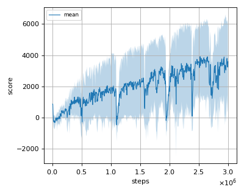
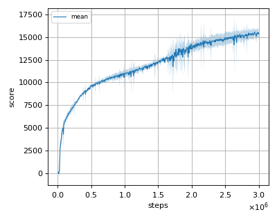
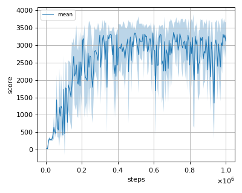
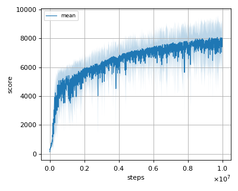

# SAC-D (Soft Actor Critic Decomposition) reproduction

This reproduction script trains the SAC-D (Soft Actor Critic Decomposition) 
algorithm proposed by J. MacGlashan, et al. in the paper: 
[Value Function Decomposition for Iterative Design of Reinforcement Learning Agents](https://arxiv.org/abs/2206.13901).

## How to run the reproduction script

To run the reproduction script do

```sh
$ python sacd_reproduction.py <options>
```

If you omit options, the script will run on FactoredAntV4NNablaRL-v1 environment with gpu id 0.

You can change the training environment and gpu as follows

```sh
$ python sacd_reproduction.py --env <env_name> --gpu <gpu_id>
```

```sh
# Example1: run the script on cpu and train the agent with (Factored) HalfCheetah:
$ python sacd_reproduction.py --env FactoredHalfCheetahV4NNablaRL-v1 --gpu -1
# Example2: run the script on gpu 1 and train the agent with (Factored) Walker2d:
$ python sacd_reproduction.py --env FactoredWalker2dV4NNablaRL-v1 --gpu 1
```

To check all available options type:

```sh
$ python sacd_reproduction.py --help
```

To check the trained result do

```sh
$ python sacd_reproduction.py --showcase --snapshot-dir <snapshot_dir> --render
```

```sh
# Example:
$ python sacd_reproduction.py --showcase --snapshot-dir ./FactoredAntV4NNablaRL-v1/seed-1/iteration-10000/ --render
```

## Evaluation

We tested our implementation with the following Factored MuJoCo environments using 3 different initial random seeds:

- FactoredAntV4NNablaRL-v1
- FactoredHalfCheetahV4NNablaRL-v1
- FactoredHopperV4NNablaRL-v1
- FactoredWalker2dV4NNablaRL-v1
- FactoredHumanoidV4NNablaRL-v1

## Result

|Env|nnabla_rl best mean score|Reported score|
|:---|:---:|:---:|
|FactoredAntV4NNablaRLV4NNablaRL-v1|3914.032+/-2240.968|~2000|
|FactoredHalfCheetahV4NNablaRL-v1|15572.712+/-420.190|~15000|
|FactoredHopperV4NNablaRL-v1|3371.358+/-108.69|~3000|
|FactoredWalker2dV4NNablaRL-v1|5421.557+/-860.17|~5500|
|FactoredHumanoidV4NNablaRL-v1|8078.444+/-448.061|~7000|

## Learning curves

### Factored Ant



### Factored HalfCheetah



### Factored Hopper



### Factored Walker2d


### Factored Humanoid


