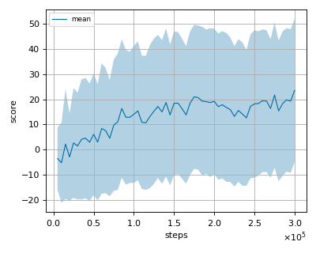
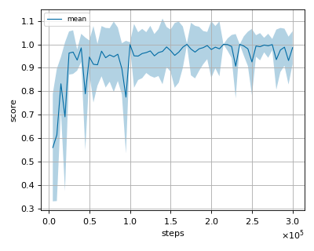

# HyAR (Hybrid Action Representation) reproduction

This reproduction script trains the HyAR (Hybrid Action Representation) algorithm proposed by Li, et al. in the paper: 
[HyAR: Addressing Discrete-Continuous Action Reinfocement Learning via Hybrid Action Representation](https://openreview.net/pdf?id=64trBbOhdGU).

## Prerequisites

Install gym-goal and/or gym-platform package from [this](https://github.com/cycraig/gym-goal) and [this](https://github.com/cycraig/gym-goal) github repository.

```sh
$ pip install -e git+https://github.com/cycraig/gym-goal#egg=gym_goal
```

```sh
$ pip install -e git+https://github.com/cycraig/gym-platform#egg=gym_platform
```

## Note

If you encounter the following error, update the gym version to 0.25.2 (Not gymnasium).

```sh
  File "/home/ishihara/github/nnabla-rl/.venv/lib/python3.9/site-packages/gym/utils/passive_env_checker.py", line 247, in passive_env_reset_check
    _check_obs(obs, env.observation_space, "reset")
  File "/home/ishihara/github/nnabla-rl/.venv/lib/python3.9/site-packages/gym/utils/passive_env_checker.py", line 113, in _check_obs
    assert observation_space.contains(
AssertionError: The observation returned by the `reset()` method is not contained with the observation space (Tuple(Box([ -0.        -15.         -1.         -1.         -3.1415927  -0.
 -15.         -1.         -1.         -3.1415927  -0.        -15.
  -3.         -3.       ], [20.        15.         1.         1.         3.1415927 20.
 15.         1.         1.         3.1415927 20.        15.
  3.         3.       ], (14,), float32), Discrete(200)))
```

```sh
$ pip install gym==0.25.2
```

## How to run the reproduction script

To run the reproduction script do

```sh
$ python hyar_reproduction.py <options>
```

If you omit options, the script will run on Goal-v0 environment with gpu id 0.

You can change the training environment and gpu as follows

```sh
$ python hyar_reproduction.py --env <env_name> --gpu <gpu_id>
```

```sh
# Example1: run the script on cpu and train the agent with Platform:
$ python hyar_reproduction.py --env Platform --gpu -1
# Example2: run the script on gpu 1 and train the agent with Goal:
$ python hyar_reproduction.py --env Goal-v0 --gpu 1
```

To check all available options type:

```sh
$ python hyar_reproduction.py --help
```

To check the trained result do

```sh
$ python hyar_reproduction.py --showcase --snapshot-dir <snapshot_dir> --render
```

```sh
# Example:
$ python hyar_reproduction.py --showcase --snapshot-dir ./Platform-v0/seed-1/iteration-250000/ --render
```

## Evaluation procedure

We tested our implementation with the following hybrid environments also used in the [original paper](https://openreview.net/pdf?id=64trBbOhdGU) using 3 different initial random seeds:

- Goal-v0
- Platform-v0

## Result

Result of our implementation is the average of 3 different initial random seeds.

Our implementation seems to perform worse in Goal-v0 environment compared to the original author's implementation. We checked the original author's implementation to find the cause of performance degredation but we could not figure out the difference.
(We are looking forward to have pull requests if anyone finds the fix to this issue)

|Env|nnabla_rl best mean score|Reported score|
|:---|:---:|:---:|
|Goal-v0|25.569+/-28.464|~35|
|Platform-v0|1.0+/-0.004|~0.95|

## Learning curves

### Goal-v0



### Platform-v0


