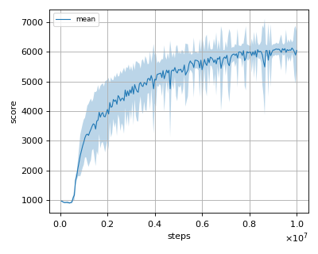
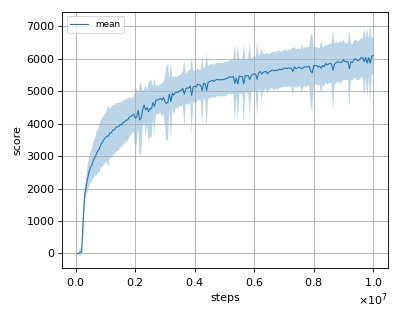
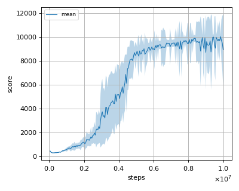

# ATRPO (Average Reward Trust Region Policy Optimization) with GAE (Generalized Advantage Estimation) reproduction

This reproduction script trains the ATRPO (Average Reward Trust Region Policy Optimization) with GAE (Generalized Advantage Estimation) algorithm proposed by Yiming Zhang et al. and J. Schulman et al. in the paper: [On-Policy Deep Reinforcement Learning for the Average-Reward Criterion](https://arxiv.org/abs/2106.07329) and [High-Dimensional Continuous Control Using Generalized Advantage Estimation](https://arxiv.org/abs/1506.02438).

## How to run the reproduction script

To run the reproduction script do

```sh
$ python atrpo_reproduction.py <options>
```

If you omit options, the script will run on Ant-v3 environment with gpu id 0.

You can change the training environment and gpu as follows

```sh
$ python atrpo_reproduction.py --env <env_name> --gpu <gpu_id>
```

```sh
# Example1: run the script on cpu and train the agent with HalfCheetah:
$ python atrpo_reproduction.py --env Humanoid-v3 --gpu -1
# Example2: run the script on gpu 1 and train the agent with Walker2d:
$ python atrpo_reproduction.py --env HalfCheetah-v3 --gpu 1
```

To check all available options type:

```sh
$ python atrpo_reproduction.py --help
```

To check the trained result do

```sh
$ python atrpo_reproduction.py --showcase --snapshot-dir <snapshot_dir> --render
```

```sh
# Example:
$ python trpo_reproduction.py --showcase --snapshot-dir ./Ant-v2/seed-1/iteration-10000/ --render
```

## Evaluation

We tested our implementation with following MuJoCo environments using 3 different initial random seeds:

- Ant-v3
- HalfCheetah-v3
- Humanoid-v3

## Result

Reported score is rough estimate from the Figure 4 of the [atrpo paper](https://arxiv.org/pdf/2106.07329.pdf).

|Env|nnabla_rl best mean score|Reported score|
|:---|:---:|:---:|
|Ant-v3|6307.470+/-130.045|~5500|
|HalfCheetah-v3|6840.333+/-52.198|~6000|
|Humanoid-v3|10339.390+/-43.053|~9500|

## Learning curves

### Ant-v3



### HalfCheetah-v3



### Humanoid-v3


