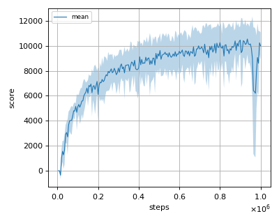
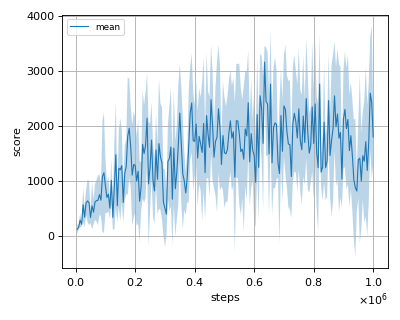
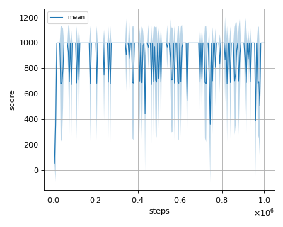

# DDPG (Deep Deterministic Policy Gradient) reproduction

This reproduction script trains the DDPG (Deep Deteministic Policy Gradient) algorithm proposed by T. P. Lillicrap, et al. in the paper: [Continuous control with deep reinforcement learning](https://arxiv.org/abs/1509.02971).

## How to run the reproduction script

To run the reproduction script do

```sh
$ python ddpg_reproduction.py <options>
```

If you omit options, the script will run on Ant-v2 environment with gpu id 0.

You can change the training environment and gpu as follows

```sh
$ python ddpg_reproduction.py --env <env_name> --gpu <gpu_id>
```

```sh
# Example1: run the script on cpu and train the agent with HalfCheetah:
$ python ddpg_reproduction.py --env HalfCheetah-v2 --gpu -1
# Example2: run the script on gpu 1 and train the agent with Walker2d:
$ python ddpg_reproduction.py --env Walker2d-v2 --gpu 1
```

To check all available options type:

```sh
$ python ddpg_reproduction.py --help
```

To check the trained result do

```sh
$ python ddpg_reproduction.py --showcase --snapshot-dir <snapshot_dir> --render
```

```sh
# Example:
$ python ddpg_reproduction.py --showcase --snapshot-dir ./Ant-v2/seed-1/iteration-10000/ --render
```

## Evaluation

We tested our implementation with 4(+4) MuJoCo environments using 3 different initial random seeds.
nnablaRL's implementation of DDPG is same as the "OurDDPG" which was presented in [TD3 paper](https://arxiv.org/pdf/1802.09477.pdf) and is slightly different from original [DDPG paper](https://arxiv.org/pdf/1509.02971.pdf).

- Ant-v2
- HalfCheetah-v2
- Hopper-v2
- InvertedDoublePendulum-v2
- InvertedPendulum-v2
- Reacher-v2
- Swimmer-v2
- Walker2d-v2

## Result

|Env|nnabla_rl best mean score|Reported score|
|:---|:---:|:---:|
|Ant-v2|**998.16+/-3.41**|888.77|
|HalfCheetah-v2|**10547.678+/-1243.365**|8577.29|
|Hopper-v2|**3162.059+/-297.692**|1860.02|
|InvertedDoublePendulum-v2|6238.098+/-4391.485|N/A|
|InvertedPendulum-v2|1000.0+/-0.0|N/A|
|Reacher-v2|-3.66+/-1.62|N/A|
|Swimmer-v2|98.124+/-82.015|N/A|
|Walker2d-v2|**4075.864+/-1456.147**|3098.11|

## Learning curves

### Ant-v2


### HalfCheetah-v2



### Hopper-v2



### InvertedDoublePendulum-v2


### InvertedPendulum-v2



### Reacher-v2


### Swimmer-v2


### Walker2d-v2


