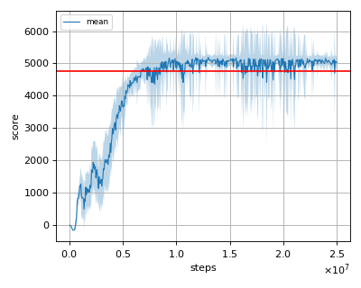

# GAIL (Generative Adversarial Imitation Learning) reproduction

This reproduction script trains the GAIL (Generative Adversarial Imitation Learning) algorithm proposed by J. Ho, et al. in the paper: [Generative Adversarial Imitation Learning](https://arxiv.org/abs/1606.03476).

## Prerequisites

Install [d4rl](https://github.com/rail-berkeley/d4rl) before starting the training. (And also you'll need the mujoco software license to use mujoco)

```sh
$ pip install git+https://github.com/rail-berkeley/d4rl@master#egg=d4rl
```

## To run the training

```sh
$ python gail_reproduction.py --env 'ant-expert-v2'
```

## Tested datasets

In order to check our implementation, we used below d4rl's datasets.
Below datasets contain experiences of similar agent's score mentioned in the [original paper](https://arxiv.org/abs/1606.03476).

- ant-expert-v2
- halfcheetah-medium-v2
- hopper-expert-v2
- walker2d-expert-v2

## Result

|Env|nnabla_rl best mean score|reference policy's score|
|:---|:---:|:---:|
|ant-expert-v2|5224.985+/-196.483|4778.4717|
|halfcheetah-medium-v2|5186.573+/-104.081|4770.3174|
|hopper-expert-v2|3639.06+/-12.43|3609.961|
|walker2d-expert-v2|5029.58+/-82.39|4925.914|

## Learning curves

Red horizontal line is the reference policy's score. </br>
Shaded region is the standard deviation of trained policy's score.

### ant-expert-v2


### halfcheetah-medium-v2



### hopper-expert-v2


### walker2d-expert-v2


