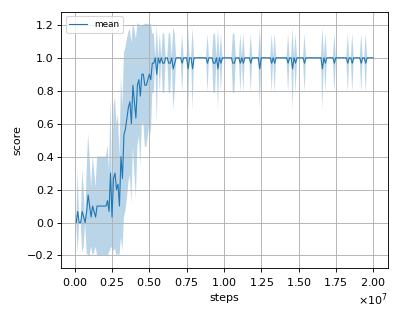
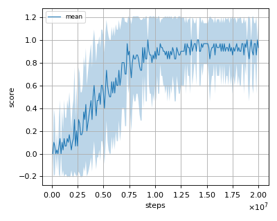
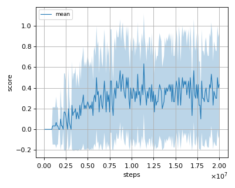

# HER (Hindsight Experience Replay) reproduction

This reproduction script trains the HER (Hindsight Experience Replay) algorithm proposed by M. Andrychowicz, et al. in the paper: [Hindsight Experience Replay](https://arxiv.org/abs/1707.01495).

## Prerequisites

Install [gym-robotics](https://github.com/Farama-Foundation/Gym-Robotics) before starting the training.

```sh
$ pip install gym-robotics
```


## How to run the reproduction script

To run the reproduction script do

```sh
$ python her_reproduction.py <options>
```

If you omit options, the script will run on FetchPush-v1 environment with gpu id -1 (that is, the script will run on CPU).
You can change the training environment and gpu as follows

```sh
$ python her_reproduction.py --env <env_name> --gpu <gpu_id>
```

```sh
# Example1: run the script on cpu and train the agent with FetchSlide:
$ python her_reproduction.py --env FetchSlide-v1 --gpu -1
# Example2: run the script on gpu 1 and train the agent with FetchPickAndPlace:
$ python her_reproduction.py --env FetchPickAndPlace-v1 --gpu 1
```

To check all available options type:

```sh
$ python her_reproduction.py --help
```

To check the trained result do

```sh
$ python her_reproduction.py --showcase --snapshot-dir <snapshot_dir> --render
```

```sh
# Example:
$ python her_reproduction.py --showcase --snapshot-dir ./FetchPush-v1/seed-1/iteration-100000/ --render
```

Note that the agent can learn only when the script will run on CPU.
So, please set gpu_id = -1 when training agent.

## Evaluation

We tested our implementation with 3 MuJoCo environments using 3 different initial random seeds.
These environments are used in the [original paper](https://arxiv.org/abs/1707.01495)

- FetchPush-v1
- FetchPickAndPlace-v1
- FetchSlide-v1

## Learning curves

### FetchPush-v1



### FetchPickAndPlace-v1



### FetchSlide-v1


