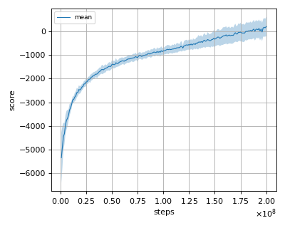

# TRPO (Trust Region Policy Optimization) with monte carlo estimate of values (single path procedure) reproduction

This reproduction script trains the TRPO (Trust Region Policy Optimization) algorithm proposed by J. Schulman et al. in the paper: [Trust Region Policy Optimization](https://arxiv.org/abs/1502.05477).

## How to run the reproduction script

To run the reproduction script do

```sh
$ python icml2015trpo_reproduction.py <options>
```

If you omit options, the script will run on Hopper-v2 environment with gpu id 0.

You can change the training environment and gpu as follows

```sh
$ python icml2015trpo_reproduction.py --env <env_name> --gpu <gpu_id>
```

```sh
# Example1: run the script on cpu and train the agent with HalfCheetah:
$ python icml2015trpo_reproduction.py --env HalfCheetah-v2 --gpu -1
# Example2: run the script on gpu 1 and train the agent with Walker2d:
$ python icml2015trpo_reproduction.py --env -Walker2d-v2 --gpu 1
```

To check all available options type:

```sh
$ python icml2015trpo_reproduction.py --help
```

To check the trained result do

```sh
$ python icml2015trpo_reproduction.py --showcase --snapshot-dir <snapshot_dir> --render
```

```sh
# Example:
$ python icml2015trpo_reproduction.py --showcase --snapshot-dir ./Hopper-v2/seed-1/iteration-1000000/ --render
```

## Evaluation

We tested our implementation with following MuJoCo environments using 3 different initial random seeds:

- HalfCheetah-v2
- Hopper-v2
- Walker2d-v2

## Result

We could not find appropriate score values to compare with in the [original paper](https://arxiv.org/pdf/1502.05477.pdf) for the tasks which we conducted.
We show here the comparison of scores with our implementation of [TRPO with GAE](../trpo/README.md)

|Env|TRPO with monte carlo estimate|TRPO with GAE|
|:---|:---:|:---:|
|HalfCheetah-v2|216.338+/-413.095|1734.41+/-445.055|
|Hopper-v2|1151.438+/-549.812|2348.019+/-1505.909|
|Walker2d-v2|327.199+/-134.622|3390.685+/-737.093|

## Learning curves

### HalfCheetah-v2



### Hopper-v2


### Walker2d-v2


