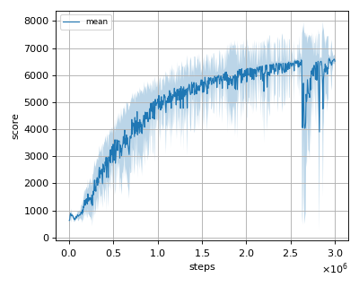
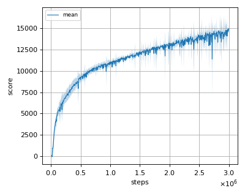
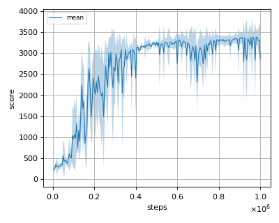
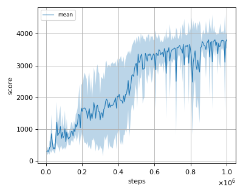

# ICML2018SAC (Soft Actor Critic with reward scaling) reproduction

This reproduction script trains the SAC (Soft Actor Critic) algorithm proposed by T. Haarnoja et al. in the paper: [Soft Actor-Critic: Off-Policy Maximum Entropy Deep Reinforcement Learning with a Stochastic Actor](https://arxiv.org/abs/1801.01290).

## How to run the reproduction script

To run the reproduction script do

```sh
$ python icml2018sac_reproduction.py <options>
```

If you omit options, the script will run on Ant-v2 environment with gpu id 0.

You can change the training environment and gpu as follows

```sh
$ python icml2018sac_reproduction.py --env <env_name> --gpu <gpu_id>
```

```sh
# Example1: run the script on cpu and train the agent with HalfCheetah:
$ python icml2018sac_reproduction.py --env HalfCheetah-v2 --gpu -1
# Example2: run the script on gpu 1 and train the agent with Walker2d:
$ python icml2018sac_reproduction.py --env Walker2d-v2 --gpu 1
```

To check all available options type:

```sh
$ python icml2018sac_reproduction.py --help
```

To check the trained result do

```sh
$ python icml2018sac_reproduction.py --showcase --snapshot-dir <snapshot_dir> --render
```

```sh
# Example:
$ python icml2018sac_reproduction.py --showcase --snapshot-dir ./Ant-v2/seed-1/iteration-10000/ --render
```

## Evaluation

We tested our implementation with 4 MuJoCo environments as in the [original paper](https://arxiv.org/pdf/1801.01290.pdf) using 3 different initial random seeds:

- Ant-v2
- HalfCheetah-v2
- Hopper-v2
- Walker2d-v2

## Result

|Env|nnabla_rl best mean score|Reported score|
|:---|:---:|:---:|
|Ant-v2|6040.918+/-549.097|~6000|
|HalfCheetah-v2|14708.591+/-909.247|~15000|
|Hopper-v2|3388.758+/-135.154|~3300|
|Walker2d-v2|3814.35+/-233.07|~3800|

## Learning curves

### Ant-v2



### HalfCheetah-v2



### Hopper-v2



### Walker2d-v2


