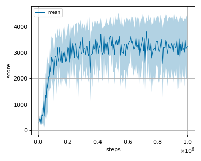

# Implicit Q-learning (IQL) reproduction (offline)

This reproduction script trains the Implicit Q-learning (IQL) algorithm proposed by proposed by I. Kostrikov, et al.
in the paper: [OFFLINE REINFORCEMENT LEARNING WITH IMPLICIT Q-LEARNING](https://arxiv.org/abs/2110.06169)

## Prerequisite

Install d4rl

```
pip install git+https://github.com/rail-berkeley/d4rl@master#egg=d4rl
```

## How to run the reproduction script

To run the reproduction script do

```sh
python iql_reproduction.py <options>
```

If you omit options, the script will run on halfcheetah-medium-expert-v2 environment with gpu id 0.

You can change the training environment and gpu as follows

```sh
python iql_reproduction.py --env <env_name> --gpu <gpu_id>
```

```sh
# Example: run the script on cpu and train the agent with walker2d-medium-v2:
$ python iql_reproduction.py --env walker2d-medium-v2 --gpu -1
```

To check all available options type:

```sh
python iql_reproduction.py --help
```

To check the trained result do

```sh
python iql_reproduction.py --showcase --snapshot-dir <snapshot_dir> --render
```

```sh
# Example:
$ python iql_reproduction.py --showcase --snapshot-dir ./halfcheetah-medium-expert-v2/seed-1/iteration-1/ --render
```

## Evaluation procedure

We tested our implementation with 9 MuJoCo tasks also used in the [original paper](https://arxiv.org/abs/2110.06169) using 3 different initial random seeds:

We evaluated the algorithm by running 10 trials in every 5000 iterations.

## Result

Mean of expert normalized scores across 3 seeds are as follows.

|Env|nnabla-rl normalized score [%]|Reported normalized score [%] (IQL)|
|:---|:---:|:---:|
|halfcheetah-medium-v2|47.1|47.4|
|hopper-medium-v2|74.0|66.3|
|walker2d-medium-v2|83.0|78.3|
|halfcheetah-medium-replay-v2|44.5|44.2|
|hopper-medium-replay-v2|65.0|94.7|
|walker2d-medium-replay-v2|83.2|73.9|
|halfcheetah-medium-expert-v2|92.9|86.7|
|hopper-medium-expert-v2|97.4|91.5|
|walker2d-medium-expert-v2|110.4|109.6|

## Learning curves

### halfcheetah

|medium|medium-replay|medium-expert|
|:---:|:---:|:---:|
||||

### hopper

|medium|medium-replay|medium-expert|
|:---:|:---:|:---:|
||||
### walker2d

|medium|medium-replay|medium-expert|
|:---:|:---:|:---:|
||||