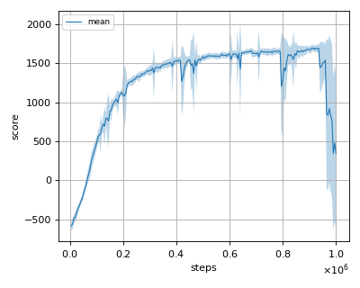
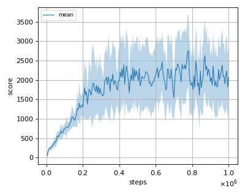
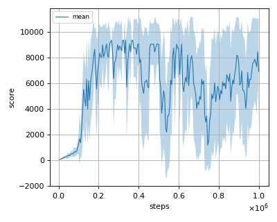
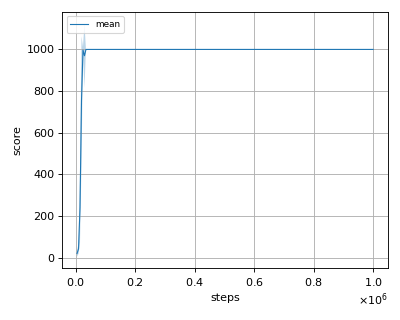
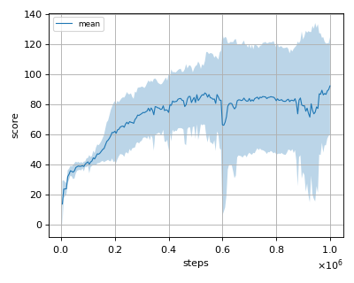

# PPO (Proximal Policy Optimization) reproduction

This reproduction script trains the PPO (Proximal Policy Optimization) algorithm proposed by J. Schulman et al. in the paper: [Proximal Policy Optimization Algorithms](https://arxiv.org/abs/1707.06347).

## How to run the reproduction script

To run the reproduction script do

```sh
$ python ppo_reproduction.py <options>
```

If you omit options, the script will run on Ant-v2 environment with gpu id 0.

You can change the training environment and gpu as follows

```sh
$ python ppo_reproduction.py --env <env_name> --gpu <gpu_id>
```

```sh
# Example1: run the script on cpu and train the agent with HalfCheetah:
$ python ppo_reproduction.py --env HalfCheetah-v2 --gpu -1
# Example2: run the script on gpu 1 and train the agent with Walker2d:
$ python ppo_reproduction.py --env -Walker2d-v2 --gpu 1
```

To check all available options type:

```sh
$ python ppo_reproduction.py --help
```

To check the trained result do

```sh
$ python ppo_reproduction.py --showcase --snapshot-dir <snapshot_dir> --render
```

```sh
# Example:
$ python ppo_reproduction.py --showcase --snapshot-dir ./Ant-v2/seed-1/iteration-10000/ --render
```

## Evaluation

We tested our implementation with following MuJoCo environments using 3 different initial random seeds:

- Ant-v2
- HalfCheetah-v2
- Hopper-v2
- InvertedDoublePendulum-v2
- InvertedPendulum-v2
- Reacher-v2
- Swimmer-v2
- Walker2d-v2

## Result

Reported score is rough estimate from the Figure 3 of the [original paper](https://arxiv.org/pdf/1707.06347.pdf).

|Env|nnabla_rl best mean score|Reported score|
|:---|:---:|:---:|
|Ant-v2|2554.089+/-731.536|N/A|
|HalfCheetah-v2|1693.484+/-37.688|~1800|
|Hopper-v2|2761.192+/-927.428|~2200|
|InvertedDoublePendulum-v2|9357.51+/-0.46|~8000|
|InvertedPendulum-v2|1000.0+/-0.0|~1000|
|Reacher-v2|-4.836+/-1.759|~-8|
|Swimmer-v2|92.367+/-32.454|~110|
|Walker2d-v2|3870.875+/-966.003|~3400|

## Learning curves

### Ant-v2


### HalfCheetah-v2



### Hopper-v2



### InvertedDoublePendulum-v2



### InvertedPendulum-v2



### Reacher-v2


### Swimmer-v2



### Walker2d-v2


