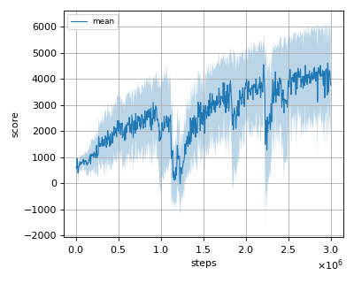
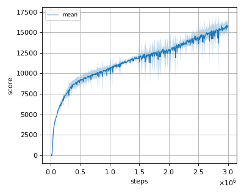
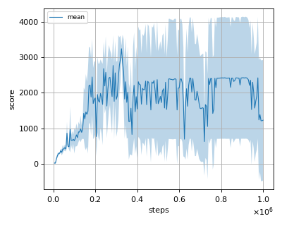
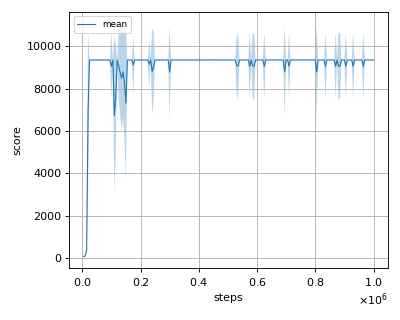
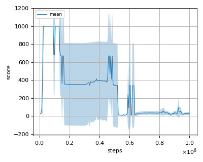
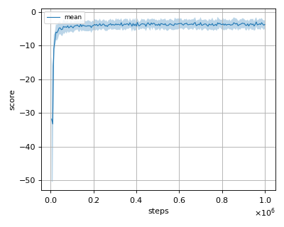
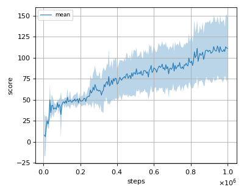
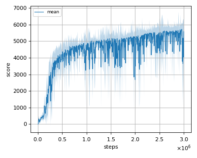

# QRSAC (Quantile Regression Soft Actor Critic) training script

This script trains the QRSAC (Quantile Regression Soft Actor Critic) algorithm proposed by
P. Wurman, et al. in the paper ["Outracing champion Gran Turismo drivers with deep reinforcement learning"](https://www.nature.com/articles/s41586-021-04357-7)
in [MuJoCo](https://mujoco.org/) environment.

## How to run the reproduction script

To run the reproduction script do

```sh
$ python qrsac_reproduction.py <options>
```

If you omit options, the script will run on Ant-v2 environment with gpu id 0.

You can change the training environment and gpu as follows

```sh
$ python qrsac_reproduction.py --env <env_name> --gpu <gpu_id>
```

```sh
# Example1: run the script on cpu and train the agent with HalfCheetah:
$ python qrsac_reproduction.py --env HalfCheetah-v2 --gpu -1
# Example2: run the script on gpu 1 and train the agent with Walker2d:
$ python qrsac_reproduction.py --env Walker2d-v2 --gpu 1
```

To check all available options type:

```sh
$ python qrsac_reproduction.py --help
```

To check the trained result do

```sh
$ python qrsac_reproduction.py --showcase --snapshot-dir <snapshot_dir> --render
```

```sh
# Example:
$ python qrsac_reproduction.py --showcase --snapshot-dir ./Ant-v2/seed-1/iteration-10000/ --render
```

## Evaluation

We tested our implementation with the following MuJoCo environments using 3 different initial random seeds:

- Ant-v2
- HalfCheetah-v2
- Hopper-v2
- InvertedDoublePendulum-v2
- InvertedPendulum-v2
- Reacher-v2
- Swimmer-v2
- Walker2d-v2

## Result

|Env|nnabla_rl best mean score|Reference score of vanilla SAC<br/>(nnabla_rl implementation)|
|:---|:---:|:---:|
|Ant-v2|4608.835+/-1496.791|6333.712+/-582.962|
|HalfCheetah-v2|15905.874+/-632.545|15628.84+/-122.80|
|Hopper-v2|3240.207+/-83.31|3572.477+/-22.762|
|InvertedDoublePendulum-v2|9359.846+/-0.157|9359.66+/-0.27|
|InvertedPendulum-v2|1000.0+/-0.0|1000.0+/-0.0|
|Reacher-v2|-2.972+/-1.387|-2.98+/-1.42|
|Swimmer-v2|113.891+/-35.236|66.465+/-8.231|
|Walker2d-v2|5715.5+/-401.4|5372.365+/-669.718|

## Learning curves

### Ant-v2



### HalfCheetah-v2



### Hopper-v2



### InvertedDoublePendulum-v2



### InvertedPendulum-v2



### Reacher-v2



### Swimmer-v2



### Walker2d-v2


