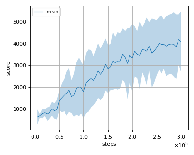
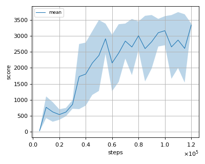
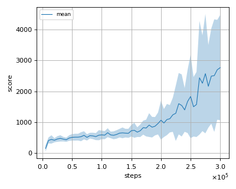
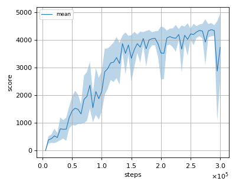

# REDQ (Randomized Ensembled Double Q-learning) reproduction

This reproduction script trains the REDQ (Randomized Ensembled Double Q-learning) algorithm proposed by X. Chen et al. in the paper:
[Randomized Ensembled Double Q-learning: Learning Fast Without a Model](https://arxiv.org/abs/2101.05982).

## How to run the reproduction script

To run the reproduction script do

```sh
$ python redq_reproduction.py <options>
```

If you omit options, the script will run on Ant-v2 environment with gpu id 0.

You can change the training environment and gpu as follows

```sh
$ python redq_reproduction.py --env <env_name> --gpu <gpu_id>
```

```sh
# Example1: run the script on cpu and train the agent with HalfCheetah:
$ python redq_reproduction.py --env HalfCheetah-v2 --gpu -1
# Example2: run the script on gpu 1 and train the agent with Walker2d:
$ python redq_reproduction.py --env Walker2d-v2 --gpu 1
```

To check all available options type:

```sh
$ python redq_reproduction.py --help
```

To check the trained result do

```sh
$ python redq_reproduction.py --showcase --snapshot-dir <snapshot_dir> --render
```

```sh
# Example:
$ python redq_reproduction.py --showcase --snapshot-dir ./Ant-v2/seed-1/iteration-10000/ --render
```

## Evaluation

We tested our implementation with the following MuJoCo environments using 3 different initial random seeds:

- Ant-v2
- Hopper-v2
- Humanoid-v2
- Walker2d-v2

## Result

|Env|nnabla_rl best mean score</br>(at 120K for Hopper-v2 and 300K for the rest) |Reported score</br>(at 300K) |
|:---|:---:|:---:|
|Ant-v2|4195.222+/-1156.727|5369|
|Hopper-v2|3341.666+/-45.389|3517|
|Humanoid-v2|2766.917+/-1700.228|4674|
|Walker2d-v2|4364.116+/-240.572|4589|

## Learning curves

### Ant-v2



### Hopper-v2



### Humanoid-v2



### Walker2d-v2


