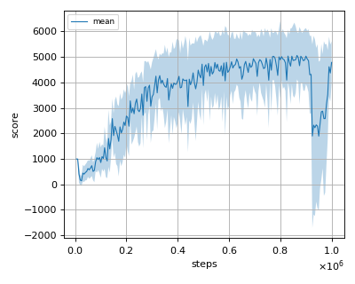
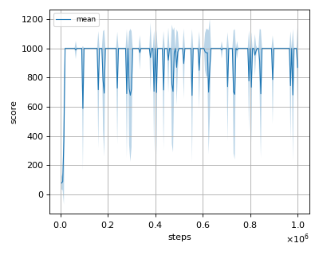
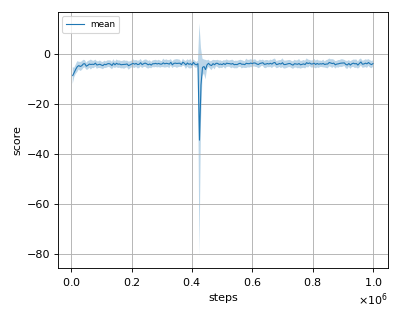
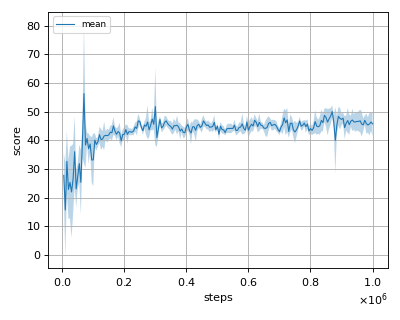
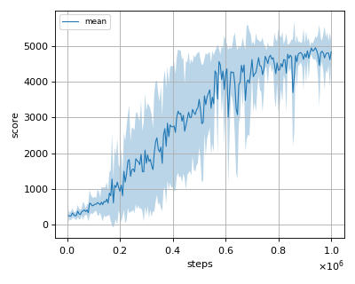

# TD3 (Twin Delayed Deep Deterministic policy gradient) reproduction

This reproduction script trains the TD3 (Twin Delayed Deep Deterministic policy gradient) algorithm proposed by S. Fujimoto et al. in the paper: [Addressing Function Approximation Error in Actor-Critic Methods](https://arxiv.org/abs/1802.09477).

## How to run the reproduction script

To run the reproduction script do

```sh
$ python td3_reproduction.py <options>
```

If you omit options, the script will run on Ant-v2 environment with gpu id 0.

You can change the training environment and gpu as follows

```sh
$ python td3_reproduction.py --env <env_name> --gpu <gpu_id>
```

```sh
# Example1: run the script on cpu and train the agent with HalfCheetah:
$ python td3_reproduction.py --env HalfCheetah-v2 --gpu -1
# Example2: run the script on gpu 1 and train the agent with Walker2d:
$ python td3_reproduction.py --env -Walker2d-v2 --gpu 1
```

To check all available options type:

```sh
$ python td3_reproduction.py --help
```

To check the trained result do

```sh
$ python td3_reproduction.py --showcase --snapshot-dir <snapshot_dir> --render
```

```sh
# Example:
$ python td3_reproduction.py --showcase --snapshot-dir ./Ant-v2/seed-1/iteration-10000/ --render
```

## Evaluation

We tested our implementation with 7(+1) MuJoCo environments also used in the original paper using 3 different initial random seeds:

- Ant-v2
- HalfCheetah-v2
- Hopper-v2
- InvertedDoublePendulum-v2
- InvertedPendulum-v2
- Reacher-v2
- Swimmer-v2
- Walker2d-v2

## Result

|Env|nnabla_rl best mean score|Reported score|
|:---|:---:|:---:|
|Ant-v2|**5056.422+/-938.283**|4372.44+/-1000.33|
|HalfCheetah-v2|**10627.57+/-843.172**|9636.95+/-859.065|
|Hopper-v2|3050.033+/-843.191|**3564.07+/-114.74**|
|InvertedDoublePendulum-v2|**9359.346+/-0.622**|9337.47+/-14.96|
|InvertedPendulum-v2|1000.0+/-0.0|1000.0+/-0.0|
|Reacher-v2|**-3.274+/-1.405**|-3.60+/-0.56|
|Swimmer-v2|56.297+/-24.402|N/A|
|Walker2d-v2|**4948.24+/-318.22**|4682.82+/-539.64|

## Learning curves

### Ant-v2



### HalfCheetah-v2


### Hopper-v2


### InvertedDoublePendulum-v2


### InvertedPendulum-v2



### Reacher-v2



### Swimmer-v2



### Walker2d-v2


