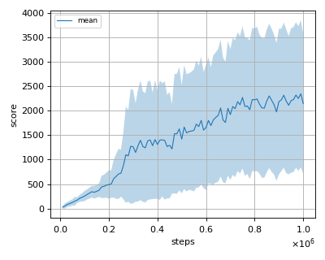
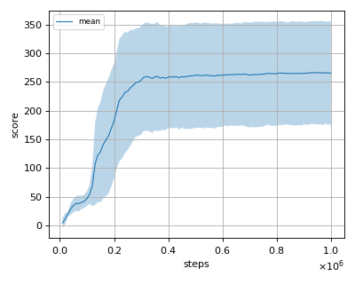
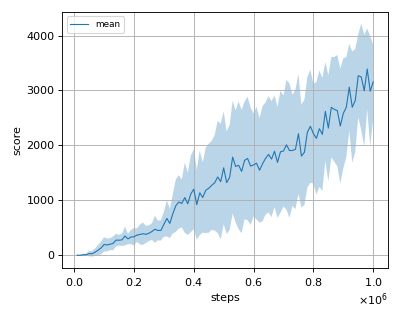

# TRPO (Trust Region Policy Optimization) with GAE (Generalized Advantage Estimation) reproduction

This reproduction script trains the TRPO (Trust Region Policy Optimization) with GAE (Generalized Advantage Estimation) algorithm proposed by J. Schulman et al. in the paper: [Trust Region Policy Optimization](https://arxiv.org/abs/1502.05477) and [High-Dimensional Continuous Control Using Generalized Advantage Estimation](https://arxiv.org/abs/1506.02438).

## How to run the reproduction script

To run the reproduction script do

```sh
$ python trpo_reproduction.py <options>
```

If you omit options, the script will run on Ant-v2 environment with gpu id 0.

You can change the training environment and gpu as follows

```sh
$ python trpo_reproduction.py --env <env_name> --gpu <gpu_id>
```

```sh
# Example1: run the script on cpu and train the agent with HalfCheetah:
$ python trpo_reproduction.py --env HalfCheetah-v2 --gpu -1
# Example2: run the script on gpu 1 and train the agent with Walker2d:
$ python trpo_reproduction.py --env Walker2d-v2 --gpu 1
```

To check all available options type:

```sh
$ python trpo_reproduction.py --help
```

To check the trained result do

```sh
$ python trpo_reproduction.py --showcase --snapshot-dir <snapshot_dir> --render
```

```sh
# Example:
$ python trpo_reproduction.py --showcase --snapshot-dir ./Ant-v2/seed-1/iteration-10000/ --render
```

## Evaluation

We tested our implementation with following MuJoCo environments using 3 different initial random seeds:

- Ant-v2
- HalfCheetah-v2
- Hopper-v2
- InvertedDoublePendulum-v2
- InvertedPendulum-v2
- Reacher-v2
- Swimmer-v2
- Walker2d-v2

## Result

Reported score is rough estimate from the Figure 3 of the [ppo paper](https://arxiv.org/pdf/1707.06347.pdf).

|Env|nnabla_rl best mean score|Reported score|
|:---|:---:|:---:|
|Ant-v2|-40.735+/-38.057|N/A|
|HalfCheetah-v2|1734.41+/-445.055|~0|
|Hopper-v2|2348.019+/-1505.909|~2100|
|InvertedDoublePendulum-v2|8993.567+/-1113.399|~0|
|InvertedPendulum-v2|1000+/-0|~1000|
|Reacher-v2|-5.011+/-1.337|~-110|
|Swimmer-v2|266.462+/-88.911|~120|
|Walker2d-v2|3390.685+/-737.093|~1050|

## Learning curves

### Ant-v2


### HalfCheetah-v2


### Hopper-v2



### InvertedDoublePendulum-v2


### InvertedPendulum-v2


### Reacher-v2


### Swimmer-v2



### Walker2d-v2


