# eXtreme Q-learning (XQL) reproduction (offline)

This reproduction script trains the eXtreme Q-learning (XQL) algorithm proposed by proposed by D. Garg, et al.
in the paper: [Extreme Q-Learning: MaxEnt RL without Entropy](https://arxiv.org/abs/2301.02328)

## Prerequisite

Install d4rl

```
pip install git+https://github.com/Farama-Foundation/d4rl@master#egg=d4rl
```

## How to run the reproduction script

To run the reproduction script do

```sh
python xql_reproduction.py <options>
```

If you omit options, the script will run on halfcheetah-medium-v2 environment with gpu id 0.

You can change the training environment and gpu as follows

```sh
python xql_reproduction.py --env <env_name> --gpu <gpu_id>
```

```sh
# Example: run the script on cpu and train the agent with Walker2d-v3:
$ python xql_reproduction.py --env walker2d-medium-v2 --gpu -1
```

To check all available options type:

```sh
python xql_reproduction.py --help
```

To check the trained result do

```sh
python xql_reproduction.py --showcase --snapshot-dir <snapshot_dir> --render
```

```sh
# Example:
$ python xql_reproduction.py --showcase --snapshot-dir ./halfcheetah-medium-v2/seed-1/iteration-1/ --render
```

## Evaluation procedure

We tested our implementation with 9 MuJoCo tasks also used in the [original paper](https://arxiv.org/abs/2301.02328) using 3 different initial random seeds:

We evaluated the algorithm by running 10 trials after each epoch.

## Result

Mean of expert normalized scores across 3 seeds are as follows.
(The scores on medium-expert datasets is different from reported results. We are investigating on this issue)

|Env|nnabla-rl normalized score [%]|Reported normalized score [%] (XQL-C)|
|:---|:---:|:---:|
|halfcheetah-medium-v2|47.6|47.7|
|hopper-medium-v2|77.9|71.1|
|walker2d-medium-v2|84.4|81.5|
|halfcheetah-medium-replay-v2|45.1|44.8|
|hopper-medium-replay-v2|97.5|97.3|
|walker2d-medium-replay-v2|75.6|75.9|
|halfcheetah-medium-expert-v2|46.2|89.8|
|hopper-medium-expert-v2|81.4|107.1|
|walker2d-medium-expert-v2|84.7|110.1|
|halfcheetah-expert-v2|94.9|-|
|hopper-expert-v2|112.9|-|
|walker2d-expert-v2|109.9|-|

## Learning curves

### halfcheetah

|medium|medium-replay|medium-expert|expert|
|:---:|:---:|:---:|:---:|
|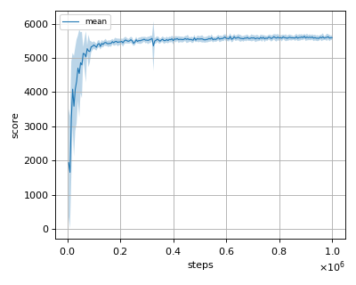|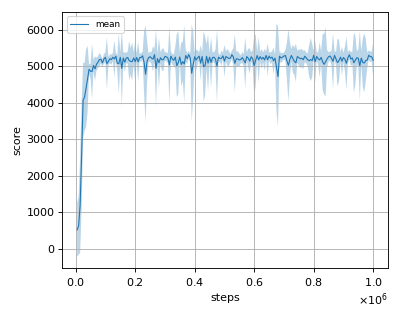|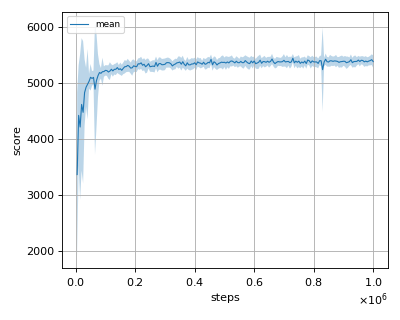|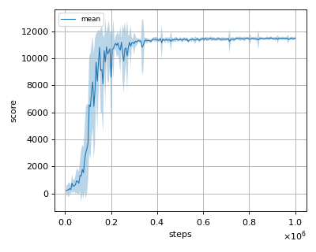|

### hopper

|medium|medium-replay|medium-expert|expert|
|:---:|:---:|:---:|:---:|
|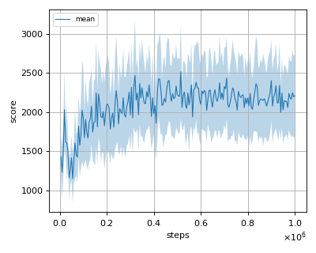|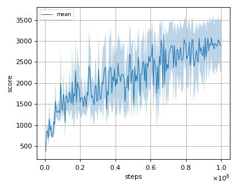|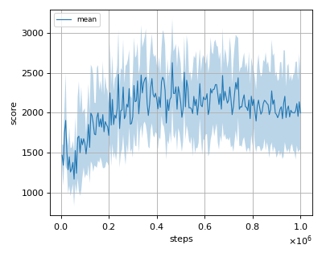|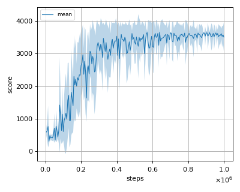|

### walker2d

|medium|medium-replay|medium-expert|expert|
|:---:|:---:|:---:|:---:|
|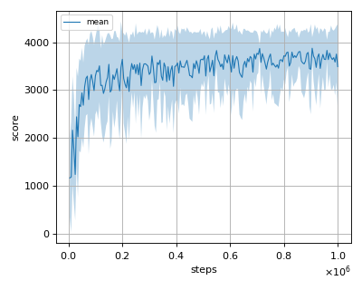|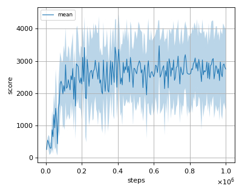|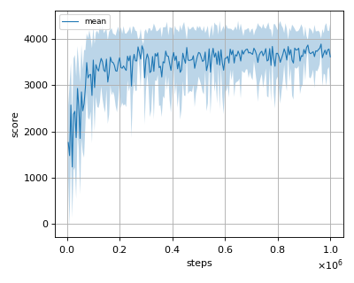|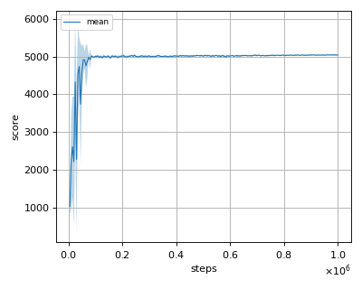|
