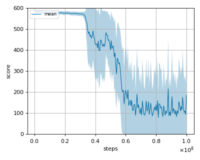
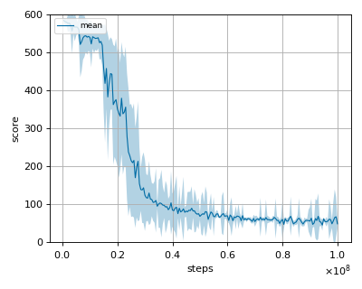
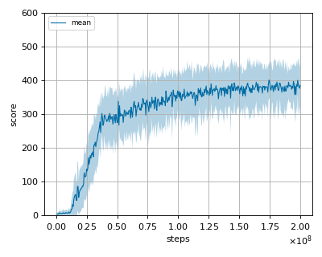

# AMP (Adversarial Motion Priors) reproduction

This reproduction script trains the AMP (Adversarial Motion Priors) algorithm proposed by 
XB Peng, et al. in the paper: [AMP: adversarial motion priors for stylized physics-based character control](https://arxiv.org/abs/2104.02180)

## Prerequisites

Install [DeepMimic env](https://github.com/xbpeng/DeepMimic).

```sh
$ git clone https://github.com/xbpeng/DeepMimic.git
```

Set the environment variables in `DeepMimic/DeepMimicCore/Makefile` (line 5 to 16).

An example setting is as follows:

```sh
export EIGEN_DIR = third/eigen-3.3.7
export BULLET_INC_DIR = third/bullet3-2.88/build_cmake/install/include/bullet/
export BULLET_LIB_DIR = third/bullet3-2.88/build_cmake/install/lib
export GLEW_INC_DIR = third/glew-2.1.0/install/usr/include/
export GLEW_LIB_DIR = third/glew-2.1.0/lib/
export FREEGLUT_INC_DIR = third/freeglut-3.0.0/install/include/
export FREEGLUT_LIB_DIR = third/freeglut-3.0.0/install/lib

PYTHON_INC = /usr/include/python3.8
PYTHON_LIB = /usr/lib/ -lpython3.8
```

Then run

```sh
$ cd DeepMimic/DeepMimicCore
$ ./build.sh
```

This should generate `DeepMimicCore.py` in `DeepMimic/DeepMimicCore`.


Copy `DeepMimic/data` to amp reproduction directory.
DeepMimic env internally set the shader and other environment setting data prefix path as `data/`.

```sh
$ cp -r DeepMimic/data .
```

Copy `DeepMimic/args` to amp reproduction directory.

```sh
$ cp -r DeepMimic/args .
```

### Troubleshooting

If you encouter segmentation errors such as 

```sh
*** Process received signal ***
Signal: Segmentation fault (11)
Signal code: Address not mapped (1)
Failing at address: 0x10
```

Comment out the `glFramebufferTexture(GL_FRAMEBUFFER, GL_DEPTH_ATTACHMENT, mTexture, 0);` at `DeepMimic/DeepMimicCore/render/ShadowMap.cpp`.

This error is caused by openGL version mismatch.

## How to run the reproduction script

To run the reproduction script do

```sh
$ python amp_reproduction.py <options>
```

If you omit options, the script will run on Humanoid Cartwheel Imitation task environment with gpu id 0.

You can change the training environment and gpu as follows

```
$ python amp_reproduction.py --args_file_path <argument file from the author's code path> --gpu <gpu_id> 
```

If you want to run training with the goal conditioned enviroments, add goal conditioned env flag.

```
$ python amp_reproduction.py --args_file_path <argument file from the author's code path> --gpu <gpu_id> --goal_conditioned_env
```

```
# Example1: run the script on cpu and train the agent with Humanoid Backfilp Imitation task:
$ python amp_reproduction.py --gpu -1 --args_file_path ./args/train_amp_humanoid3d_backflip_args.txt

# Example2: run the script on cpu and train the agent with Humanoid Locomotion goal conditioned task:
$ python amp_reproduction.py --gpu -1 --args_file_path ./args/train_amp_heading_humanoid3d_locomotion_args.txt --goal_conditioned_env

# Example3: run the script on gpu 1 and train the agent with Humanoid Backfile Imitation task:
$ python amp_reproduction.py --gpu 1 --args_file_path ./args/train_amp_humanoid3d_backflip_args.txt
```

To check all available options type:

```
$ python amp_reproduction.py --help
```

To check the trained result do without rendering 

```
$ python amp_reproduction.py --showcase --snapshot-dir <snapshot_dir>

# Example 1: check the trained result with the imitation enviroments.
$ python amp_reproduction.py --args_file_path ./args/train_amp_humanoid3d_backflip_args.txt --gpu 0 --showcase --snapshot-dir ./train_amp_heading_humanoid3d_locomotion_results/seed-0/iteration-100000000

# Example 2: check the trained result with the goal conditioned enviroments.
$ python amp_reproduction.py --args_file_path ./args/train_amp_heading_humanoid3d_locomotion_args.txt --goal_conditioned_env --gpu 0 --showcase --snapshot-dir ./train_amp_heading_humanoid3d_locomotion_results/seed-0/iteration-100000000
```

To check the trained result do with rendering

```
$ python amp_reproduction.py --showcase --snapshot-dir <snapshot_dir> --render_in_showcase

# Example 1: check the trained result with the imitation enviroments.
$ python amp_reproduction.py --args_file_path ./args/train_amp_humanoid3d_backflip_args.txt --gpu 0 --render_in_showcase --showcase --snapshot-dir ./train_amp_heading_humanoid3d_locomotion_results/seed-0/iteration-100000000

# Example 2: check the trained result with the goal conditioned enviroments.
$ python amp_reproduction.py --args_file_path ./args/train_amp_heading_humanoid3d_locomotion_args.txt --goal_conditioned_env --gpu 0 --render_in_showcase --showcase --snapshot-dir ./train_amp_heading_humanoid3d_locomotion_results/seed-0/iteration-100000000
```

# Evaluation

- We tested our implementation with following Author's environments using 3 different initial random seeds:

### Humanoid3d Imitation task

- Cartwheel
- Back-Flip

### Humanoid3d Goal conditioned task

- Target Location (Locomotion)

## Result

The reported scores are rough estimated from the Figure 9 and Figure 10 of the [amp paper](https://arxiv.org/pdf/2104.02180.pdf).
Note that reported scores of this table are normalized to 0 to 1.
As the author mentioned at [this issue](https://github.com/xbpeng/DeepMimic/issues/112), we divided the original score from the enviroment by 600.

| Imitation Env |nnabla_rl best mean score(normalized) | Reported score(normalized) |
|:---|:---:|:---:|
|Humanoid3d Cartwheel|0.075|~0.15|
|Humanoid3d Backflip|0.132|~0.1|

| Goal conditioned Env | nnabla_rl best mean score(normalized) | Reported score(normalized) |
|:---|:---:|:---:|
|Humanoid3d Target Location (Locomotion)|0.669|~0.65|

## Learning curves

### humanoid3d_backflip



### humanoid3d_cartwheel



### humanoid3d_target_location_locomotion


