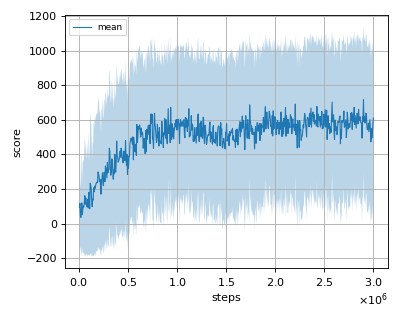
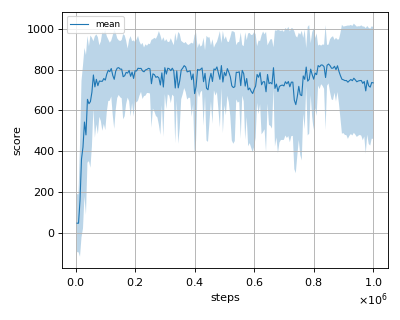
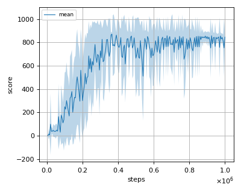
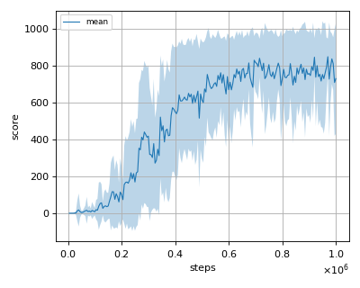

# DEMMESAC (DisEntangled Max-Min Entropy Soft Actor Critic) reproduction

This reproduction script trains the DEMME-SAC (DisEntangled Max-Min Entropy Soft Actor Critic) algorithm proposed by 
S. Han, et al. in the paper: [A Max-Min Entropy Framework for Reinforcement Learning](https://arxiv.org/abs/2106.10517)

## Prerequisites

Install [sparse mujoco environment](../environment).

```sh
$ cd ../environment
$ pip install -e .
```

## How to run the reproduction script

To run the reproduction script do

```sh
$ python demme_sac_reproduction.py <options>
```

If you omit options, the script will run on SparseAnt-v1 environment with gpu id 0.

You can change the training environment and gpu as follows

```sh
$ python demme_sac_reproduction.py --env <env_name> --gpu <gpu_id>
```

```sh
# Example1: run the script on cpu and train the agent with SparseHalfCheetah:
$ python demme_sac_reproduction.py --env SparseHalfCheetah-v1 --gpu -1
# Example2: run the script on gpu 1 and train the agent with SparseWalker2d:
$ python demme_sac_reproduction.py --env SparseWalker2d-v1 --gpu 1
```

To check all available options type:

```sh
$ python demme_sac_reproduction.py --help
```

To check the trained result do

```sh
$ python demme_sac_reproduction.py --showcase --snapshot-dir <snapshot_dir> --render
```

```sh
# Example:
$ python demme_sac_reproduction.py --showcase --snapshot-dir ./SparseAnt-v1/seed-1/iteration-10000/ --render
```

## Evaluation

We tested our implementation with 4 Sparse MuJoCo environments as in the [mme sac paper](https://arxiv.org/abs/2106.10517) using 10 different initial random seeds:

- SparseAnt-v1
- SparseHalfCheetah-v1
- SparseHopper-v1
- SparseWalker2d-v1

## Result

|Env|nnabla_rl best mean score|Reported score|
|:---|:---:|:---:|
|SparseAnt-v1|716.10+/-424.00|973.60+/-12.55|
|SparseHalfCheetah-v1|827.46+/-95.08|924.90+/-39.57|
|SparseHopper-v1|871.68+/-16.909|893.30+/-6.72|
|SparseWalker2d-v1|850.73+/-98.89|886.60+_/-25.77|

## Learning curves

### SparseAnt-v1



### SparseHalfCheetah-v1



### SparseHopper-v1



### SparseWalker2d-v1


