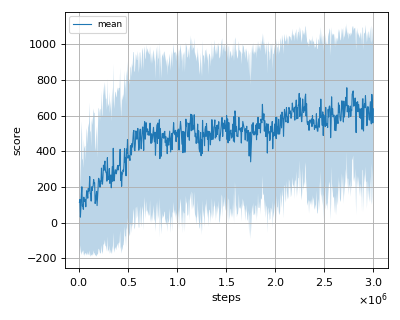
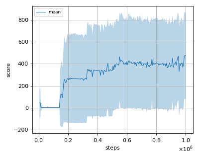
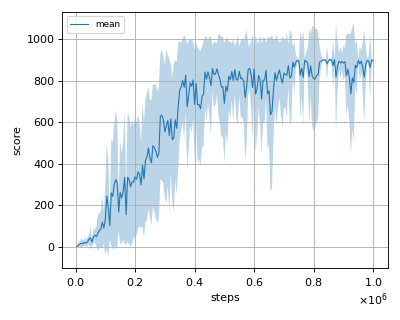
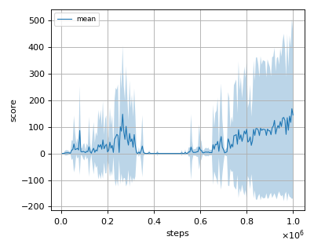

# ICML2018SAC (Soft Actor Critic with reward scaling) reproduction

This reproduction script trains the SAC (Soft Actor Critic) algorithm proposed by T. Haarnoja et al. in the paper: [Soft Actor-Critic: Off-Policy Maximum Entropy Deep Reinforcement Learning with a Stochastic Actor](https://arxiv.org/abs/1801.01290).

## Prerequisites

Install [sparse mujoco environment](../environment).

```sh
$ cd ../environment
$ pip install -e .
```

## How to run the reproduction script

To run the reproduction script do

```sh
$ python icml2018sac_reproduction.py <options>
```

If you omit options, the script will run on SparseAnt-v1 environment with gpu id 0.

You can change the training environment and gpu as follows

```sh
$ python icml2018sac_reproduction.py --env <env_name> --gpu <gpu_id>
```

```sh
# Example1: run the script on cpu and train the agent with SparseHalfCheetah:
$ python icml2018sac_reproduction.py --env SparseHalfCheetah-v1 --gpu -1
# Example2: run the script on gpu 1 and train the agent with SparseWalker2d:
$ python icml2018sac_reproduction.py --env SparseWalker2d-v1 --gpu 1
```

To check all available options type:

```sh
$ python icml2018sac_reproduction.py --help
```

To check the trained result do

```sh
$ python icml2018sac_reproduction.py --showcase --snapshot-dir <snapshot_dir> --render
```

```sh
# Example:
$ python icml2018sac_reproduction.py --showcase --snapshot-dir ./SparseAnt-v1/seed-1/iteration-10000/ --render
```

## Evaluation

We tested our implementation with 4 Sparse MuJoCo environments as in the [mme sac paper](https://arxiv.org/abs/2106.10517) using 10 different initial random seeds:

- SparseAnt-v1
- SparseHalfCheetah-v1
- SparseHopper-v1
- SparseWalker2d-v1

## Result

|Env|nnabla_rl best mean score|Reported score|
|:---|:---:|:---:|
|SparseAnt-v1|755.98+/-359.60|**963.80+/-42.51**|
|SparseHalfCheetah-v1|**477.12+/-397.09**|386.90+/-404.70|
|SparseHopper-v1|**901.51+/-5.07**|823.70+/-215.35|
|SparseWalker2d-v1|168.13+/-338.873|**273.30+/-417.51**|

## Learning curves

### SparseAnt-v1



### SparseHalfCheetah-v1



### SparseHopper-v1



### SparseWalker2d-v1


