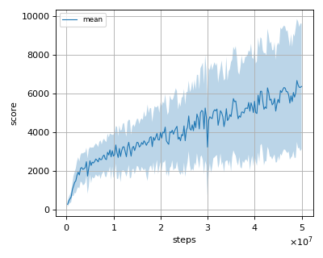
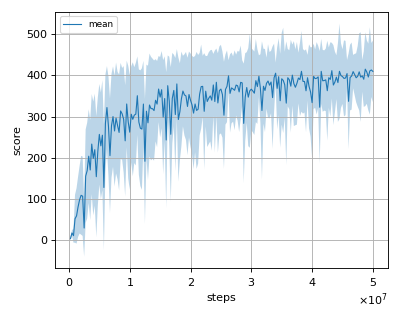
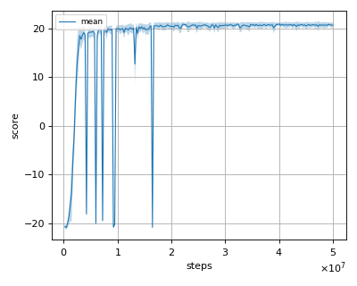
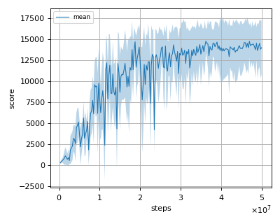
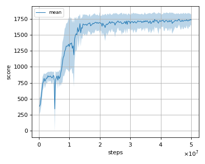

# A2C (Advantage Actor-Critic) reproduction

This reproduction script trains the A2C (Advantage Actor-Critic) algorithm.
A2C is a synchronous version of A3C (Asynchronous Advantage Actor-Critic) proposed by V. Mnih, et al. in the paper: [Asynchronous Methods for Deep Reinforcement Learning](https://arxiv.org/abs/1602.01783).

## How to run the reproduction script

To run the reproduction script do

```sh
$ python a2c_reproduction.py <options>
```

If you omit options, the script will run on BreakoutNoFrameskip-v4 environment with gpu id 0.

You can change the training environment and gpu as follows

```sh
$ python a2c_reproduction.py --env <env_name> --gpu <gpu_id>
```

```sh
# Example1: run the script on cpu and train the agent with Pong:
$ python a2c_reproduction.py --env PongNoFrameskip-v4 --gpu -1
# Example2: run the script on gpu 1 and train the agent with SpaceInvaders:
$ python a2c_reproduction.py --env SpaceInvadersNoFrameskip-v4 --gpu 1
```

To check all available options type:

```sh
$ python a2c_reproduction.py --help
```

To check the trained result do

```sh
$ python a2c_reproduction.py --showcase --snapshot-dir <snapshot_dir> --render
```

```sh
# Example:
$ python a2c_reproduction.py --showcase --snapshot-dir ./BreakoutNoFrameskip-v4/seed-1/iteration-250000/ --render
```

## Evaluation

We tested our implementation with 5 Atari games also used in the [original paper](https://arxiv.org/abs/1602.01783) using 3 different initial random seeds:

- Asterix
- BreakOut
- Pong
- Qbert
- Seaquest

We evaluated the algorithm in following settings.

* In every 1M frames (250K steps), the mean reward is evaluated using the Q-Network parameter at that timestep. 
* The evaluation step lasts for 500K frames (125K steps) but the last episode that exceeeds 125K timesteps is not used for evaluation.

Mean evaluation score is the mean score among 3 seeds at each iteration.

## Result

|Env|nnabla_rl best mean score|Reported score ([Reference](https://arxiv.org/pdf/1708.05144.pdf))|
|:---|:---:|:---:|
|AsterixNoFrameskip-v4|11690.807+/-8718.597|N/A|
|BreakoutNoFrameskip-v4|548.5+/-170.1|581.6|
|PongNoFrameskip-v4|20.947+/-0.223|19.9|
|QbertNoFrameskip-v4|14759.859+/-1437.363|15967.4|
|SeaquestFrameskip-v4|1770.909+/-65.039|1754.0|

**NOTE: Our A2C was trained with 16 threads.**

## Learning curves

### Asterix



### Breakout



### Pong



### Qbert



### Seaquest

