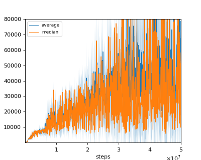
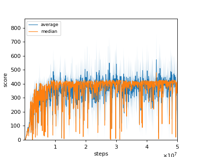
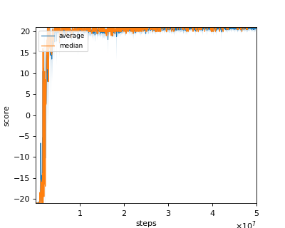
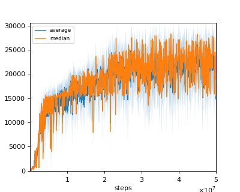
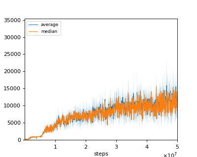

# C51 (Categorical DQN with 51 atoms) reproduction

We tested our implementation with 5 Atari games also used in the [original paper](https://arxiv.org/pdf/1707.06887.pdf).

Following Atari games was tested with single seed:

- Asterix
- Breakout
- Pong
- Qbert
- Seaquest

The only difference in our implementation from original paper is the size of replay buffer.  
We set the replay buffer size to 0.1M for computational resource limitation.

## Result

|Env|Reported score|nnabla_rl best mean score|nnabla_rl best median score|
|:---|:---:|:---:|:---:|
|Asterix|**406211**|104460|132250|
|Breakout|**748**|571.8|480|
|Pong|20.9|**21**|21|
|Qbert|23784|**26387.5**|28287.5|
|Seaquest|**266434**|15835|15705|

## Learning curves

### Asterix

### Breakout

### Pong

### Qbert

### Seaquest

