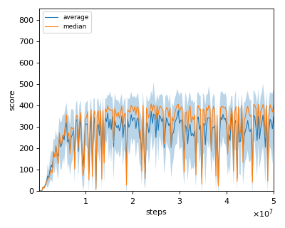

# DQN (Deep Q-Learning Network) reproduction

We tested our implementation with 1 Atari games also used in the [original paper](https://www.nature.com/articles/nature14236).  

Following Atari games was tested with single seed:

- BreakOut

## Atari Evaluation

There are 2 steps when evaluating Atari games.

1. Intermediate evaluation during training

    * In every 1M frames (250K steps), the mean reward is evaluated using the Q-Network parameter at that timestep. 
    * The evaluation step lasts for 500K frames (125K steps) but the last episode that exceeeds 125K timesteps is not used for evaluation.
    * epsilon is set to 0.05 (not greedy).

2. Final evaluation for reporting

    * The Q-Network parameter with the best mean reward is used. Each iteration parameter and evaluation result are saved in {Environment name}_result folder. You can just look through `evalutation_result_scalar.tsv` and find the maximum scored steps.
    * Using the best .h5 file, the game is played for 30 episodes with a termination threshold of 4500 steps with setting epsilon in 0.05. Then, we report the average of these 30 episodes as the score.

## Result

|Env|Reported score|nnabla_rl best mean score|nnabla_rl best median score|
|:---|:---:|:---:|:---:|
|Breakout|401.2|351.4|396.5|

## Learning curves

### Breakout

