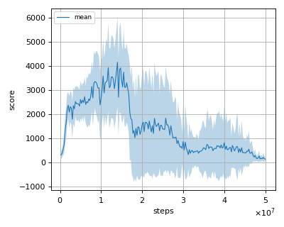
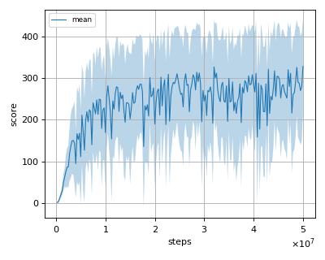
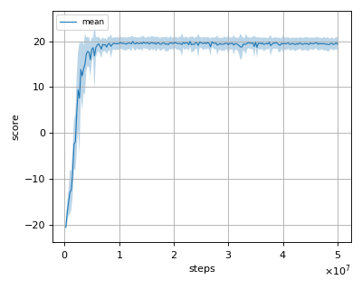
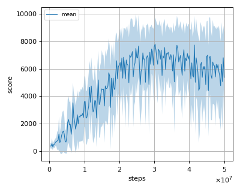

# DQN (Deep Q-Learning Network) reproduction

We tested our implementation with 5 Atari games also used in the [original paper](https://www.nature.com/articles/nature14236).  

Following Atari games was tested with 3 seeds:

- Asterix
- BreakOut
- Pong
- Qbert
- Seaquest

## Evaluation

We evaluated the algorithm in following settings.

* In every 1M frames (250K steps), the mean reward is evaluated using the Q-Network parameter at that timestep. 
* The evaluation step lasts for 500K frames (125K steps) but the last episode that exceeeds 125K timesteps is not used for evaluation.
* epsilon is set to 0.05 (not greedy).

All seeds results are combined and the mean of the score is calculated from them.

## Result

|Env|nnabla_rl best mean score|Reported score|
|:---|:---:|:---:|
|AsterixNoFrameskip-v4|4151.902+/-1878.659|6012+/-1744|
|BreakoutNoFrameskip-v4|328.513+/-113.669|401.2+/-26.9|
|PongNoFrameskip-v4|19.976+/-1.071|18.9+/1.3|
|QbertNoFrameskip-v4|7798.325+/-1958.599|10596+/-3294|
|SeaquestFrameskip-v4|3831.481+/-1842.871|5286+/-1310|

## Learning curves

### Asterix

### Breakout

### Pong

### Qbert

### Seaquest

