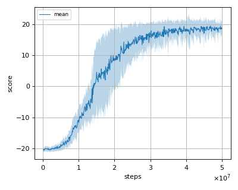

# TRPO (Trust Region Policy Optimization) reproduction

This reproduction script trains the TRPO (Trust Region Policy Optimization) algorithm proposed by J. Schulman et al. in the paper: [Trust Region Policy Optimization](https://arxiv.org/abs/1502.05477).

We tested our implementation with 1 Atari game also used in the [original paper](https://arxiv.org/pdf/1502.05477.pdf).
Please note that this version of TRPO uses Single Path method to estimate Q value instead of Generalized Advantage Estimation (GAE).

Following Atari game was tested with 3 different initial random seeds:

- Pong

There is no original implemention of this version TRPO, so some parameters that are not described in the paper are retrieved from https://github.com/openai/baselines/blob/master/baselines/trpo_mpi/defaults.py

## Result

|Env|nnabla_rl best mean score|Reported score|
|:---|:---:|:---:|
|Pong|19.467+/-1.231|**20.9**|

## Learning curves

### Pong

