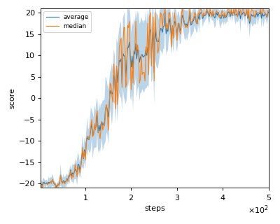
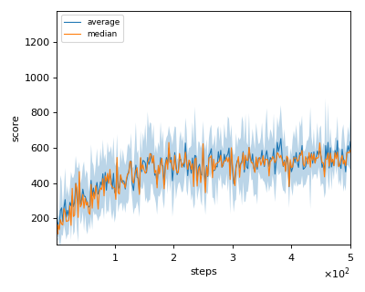

# TRPO (Trust Region Policy Optimization) reproduction

We tested our implementation with 2 Atari games also used in the [original paper](https://arxiv.org/pdf/1502.05477.pdf).
It should be noted that this version of TRPO use Single Path method to estimate Q value instead of Generalized Advantage Estimation  (GAE).        

Following Atari games was tested with single seed:

- Pong
- SpaceInvader

There is no original implemention code of this version TRPO, so some parameters that are not described in the paper are got from https://github.com/openai/baselines/blob/master/baselines/trpo_mpi/defaults.py

## Result

|Env|Reported score|nnabla_rl best mean score|nnabla_rl best median score|
|:---|:---:|:---:|:---:|
|Pong|**20.9**|20.6|21|
|SpaceInvaders|568.4|**652**|627|

## Learning curves

### Pong

### SpaceInvaders

