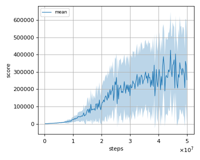
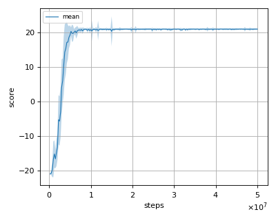
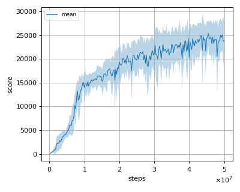

# IQN (Implicit Quantile Networks) reproduction

We tested our implementation with 5 Atari games also used in the [original paper](https://arxiv.org/pdf/1806.06923.pdf).  

Following Atari games was tested with 3 seeds:

- Asterix
- BreakOut
- Pong
- Qbert
- Seaquest

## Evaluation

We evaluated the algorithm in following settings.

* In every 1M frames (250K steps), the mean reward is evaluated using the Q-Network parameter at that timestep. 
* The evaluation step lasts for 500K frames (125K steps) but the last episode that exceeeds 125K timesteps is not used for evaluation.
* epsilon is set to 0.001 (not greedy).

All seeds results are combined and the mean of the score is calculated from them.

## Result

|Env|nnabla_rl best mean score|Reported score|
|:---|:---:|:---:|
|AsterixNoFrameskip-v4|426228.889+/-221616.644|342016|
|BreakoutNoFrameskip-v4|691.667+/-198.017|734|
|PongNoFrameskip-v4|20.991+/-0.092|21.0|
|QbertNoFrameskip-v4|25388.993+/-2696.279|25750|
|SeaquestFrameskip-v4|35917.778+/-20879.541|30140|

## Learning curves

### Asterix

### Breakout

### Pong

### Qbert

### Seaquest

