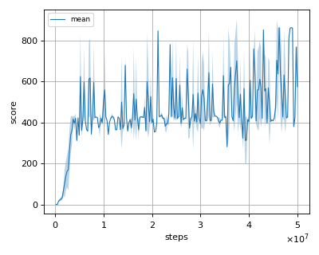

# Munchausen IQN (Munchausen Implicit Quantile Network) reproduction

We tested our implementation with Atari games also used in the [original paper](https://proceedings.neurips.cc/paper/2020/file/2c6a0bae0f071cbbf0bb3d5b11d90a82-Paper.pdf).  

## Atari Evaluation

We evaluated the algorithm as follows.

 * In every 1M frames (250K steps), the mean reward is evaluated using the Q-Network parameter at that timestep.
 * The evaluation step lasts for 500K frames (125K steps) but the last episode that exceeeds 125K timesteps is not used for evaluation.
 * epsilon is set to 0.05 (not greedy).

## Result

|Env|nnabla_rl best mean score|nnabla_rl best median score|
|:---|:---:|:---:|:---:|
|Breakout|864.0|864.0|

## Learning curves

### Breakout

