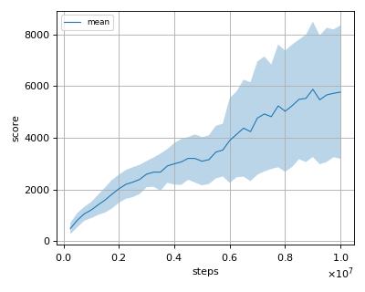
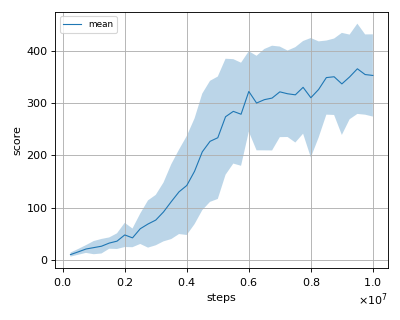
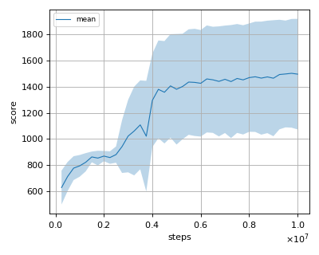

# PPO (Proximal Policy Optimization) reproduction

This reproduction script trains the PPO (Proximal Policy Optimization) algorithm proposed by J. Schulman et al. in the paper: [Proximal Policy Optimization Algorithms](https://arxiv.org/abs/1707.06347).

We tested our implementation with 5 Atari games also used in the [original paper](https://arxiv.org/abs/1707.06347) with 3 different initial random seeds:

- Asterix
- BreakOut
- Pong
- Qbert
- Seaquest

## Evaluation

We evaluated the algorithm in following settings.

* Every 1M frames (250K steps), the mean reward is evaluated using the policy at that timestep. 
* The evaluation step lasts for 500K frames (125K steps) but the last episode that exceeeds 125K timesteps is not used for evaluation.
* Each action is sampled from the learned policy's action distribution.

Below score is the mean score among 3 seeds.

## Result

|Env|nnabla_rl best mean score|Reported score|
|:---|:---:|:---:|
|AsterixNoFrameskip-v4|**5871.7+/-2619.5**|4532.5|
|BreakoutNoFrameskip-v4|**365.5+/-86.3**|274.8|
|PongNoFrameskip-v4|**20.9+/-0.3**|20.7|
|QbertNoFrameskip-v4|**14373.3+/-2776.2**|14293.3|
|SeaquestFrameskip-v4|**1501.9+/-415.6**|1204.5|

## Learning curves

### Asterix

### Breakout

### Pong

### Qbert

### Seaquest

