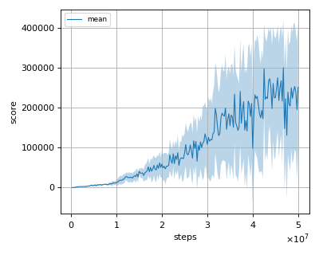
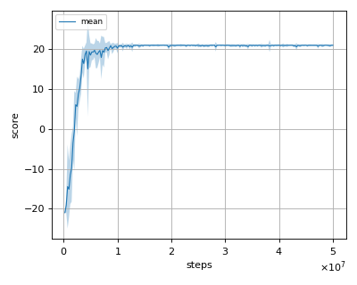

# QR-DQN (Distributional Reinforcement Learning with Quantile Regression) reproduction

This reproduction script trains the PPO (Proximal Policy Optimization) algorithm proposed by W. Dabney et al. in the paper: [Distributional Reinforcement Learning with Quantile Regression](https://arxiv.org/abs/1710.10044).

## How to run the reproduction script

To run the reproduction script do

```sh
$ python qrdqn_reproduction.py <options>
```

If you omit options, the script will run on BreakoutNoFrameskip-v4 environment with gpu id 0.

You can change the training environment and gpu as follows

```sh
$ python qrdqn_reproduction.py --env <env_name> --gpu <gpu_id>
```

```sh
# Example1: run the script on cpu and train the agent with Pong:
$ python qrdqn_reproduction.py --env PongNoFrameskip-v4 --gpu -1
# Example2: run the script on gpu 1 and train the agent with SpaceInvaders:
$ python qrdqn_reproduction.py --env SpaceInvadersNoFrameskip-v4 --gpu 1
```

To check all available options type:

```sh
$ python qrdqn_reproduction.py --help
```

To check the trained result do

```sh
$ python qrdqn_reproduction.py --showcase --snapshot-dir <snapshot_dir> --render
```

```sh
# Example:
$ python qrdqn_reproduction.py --showcase --snapshot-dir ./BreakoutNoFrameskip-v4/seed-1/iteration-250000/ --render
```

## Evaluation

We tested our implementation with 5 Atari games also used in the [original paper](https://arxiv.org/abs/1710.10044) with 3 different initial random seeds:

- Asterix
- BreakOut
- Pong
- Qbert
- Seaquest

We evaluated the algorithm in following settings.

* In every 1M frames (250K steps), the mean reward is evaluated using the Q-Network parameter at that timestep. 
* The evaluation step lasts for 500K frames (125K steps) but the last episode that exceeeds 125K timesteps is not used for evaluation.
* epsilon is set to 0.001 (not greedy).

Below score is the mean score among 3 seeds.

## Result

|Env|nnabla_rl best mean score|Reported score (QR-DQN-1)|
|:---|:---:|:---:|
|AsterixNoFrameskip-v4|300921.818+/-122332.793|261025|
|BreakoutNoFrameskip-v4|588.0+/-218.113|742|
|PongNoFrameskip-v4|20.995+/-0.067|21.0|
|QbertNoFrameskip-v4|22146.078+/-4277.151|572510|
|SeaquestFrameskip-v4|37646.667+/-26759.052|8268|

## Learning curves

### Asterix



### Breakout


### Pong



### Qbert


### Seaquest

