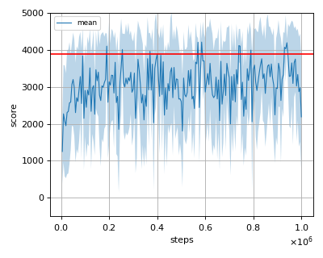
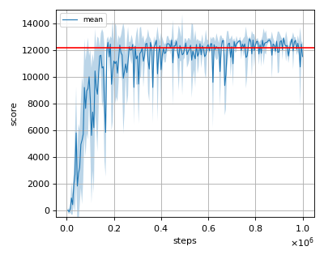
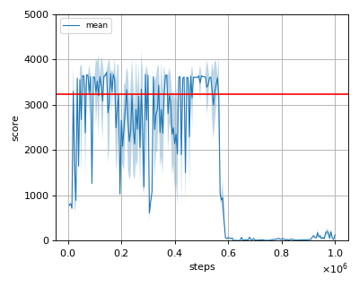

# BEAR (Bootstrapping Error Accumulation Reduction) reproduction

This reproduction script trains the BEAR (Bootstrapping Error Accumulation Reduction) algorithm proposed by A. Kumar, et al. in the paper: [Stabilizing Off-Policy Q-Learning via Bootstrapping Error Reduction](https://arxiv.org/abs/1906.00949).

## Prerequisites

Install [d4rl](https://github.com/rail-berkeley/d4rl) before starting the training. (And also you'll need the mujoco software license to use mujoco)

```sh
$ pip install git+https://github.com/rail-berkeley/d4rl@master#egg=d4rl
```

## Run training

Use d4rl env for reproduction (This reproduction code only supports mujoco environment provided in d4rl).

```sh
$ python bear_reproduction.py --env 'ant-expert-v0'
```

## Tested environments

- ant-expert-v0
- halfcheetah-expert-v0
- hopper-expert-v0
- walker2d-expert-v0

## Reproduction results

Red horizontal line is the baseline agent's score. </br>
Shaded region is the standard deviation of evaluation score. </br>
Tested environment is not completely the same as the original paper but the result with gaussian mmd is similar to that of performance presented in the [BEAR paper](https://arxiv.org/pdf/1906.00949.pdf).
However, we observed that the training sometimes fails due to the numerical instability.

### expert datasets

Policy was trained with both gaussian and laplacian mmd kernel using expert datasets.
Training result with gaussian mmd performed better in our experiment.

### ant-expert-v0

| gaussian | laplacian |
|:---:|:---:|
|||

### halfcheetah-expert-v0

|gaussian|laplacian|
|:---:|:---:|
|||

### hopper-expert-v0

|gaussian|laplacian|
|:---:|:---:|
|||

### walker2d-expert-v0

|gaussian|laplacian|
|:---:|:---:|
|||

