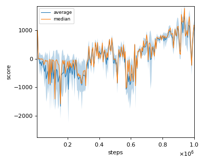
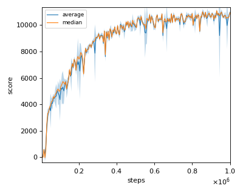
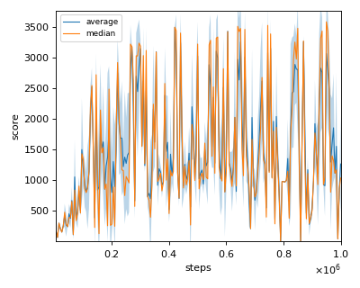
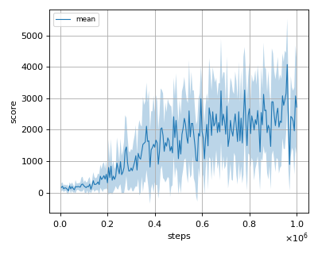

# DDPG (Deep Deterministic Policy Gradient) reproduction

We tested our implementation with 4 MuJoCo environments.
Our implementation of DDPG is same as the "OurDDPG" which was presented in [TD3 paper](https://arxiv.org/pdf/1802.09477.pdf) and is a bit different from original [DDPG paper](https://arxiv.org/pdf/1509.02971.pdf).

Following MuJoCo environments was tested with single seed:

- Ant-v2
- HalfCheetah-v2
- Hopper-v2
- Walker2d-v2

## Result

|Env|nnabla_rl best mean score|Reported score|
|:---|:---:|:---:|:---:|
|Ant-v2|**1507.36+/-469.19**|888.77|
|HalfCheetah-v2|**11053.76+/-164.23**|8577.29|
|Hopper-v2|**3487.42+/-14.60**|1860.02|
|Walker2d-v2|**4216.38+/-1812.46**|3098.11|

## Learning curves

### Ant-v2

### HalfCheetah-v2

### Hopper-v2

### Walker2d-v2

