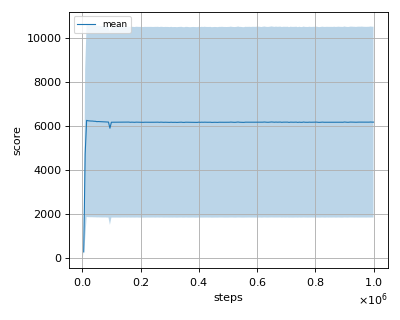
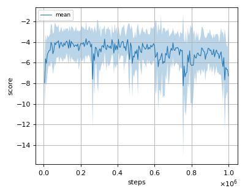
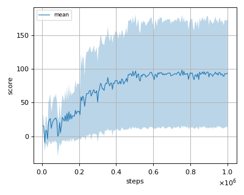

# DDPG (Deep Deterministic Policy Gradient) reproduction

We tested our implementation with 4 MuJoCo environments.
Our implementation of DDPG is same as the "OurDDPG" which was presented in [TD3 paper](https://arxiv.org/pdf/1802.09477.pdf) and is a bit different from original [DDPG paper](https://arxiv.org/pdf/1509.02971.pdf).

We tested our implementation with following MuJoCo environments using 3 different initial random seeds:

- Ant-v2
- HalfCheetah-v2
- Hopper-v2
- Walker2d-v2

## Result

|Env|nnabla_rl best mean score|Reported score|
|:---|:---:|:---:|
|Ant-v2|**998.16+/-3.41**|888.77|
|HalfCheetah-v2|**10547.678+/-1243.365**|8577.29|
|Hopper-v2|**3162.059+/-297.692**|1860.02|
|InvertedDoublePendulum-v2|6238.098+/-4391.485|N/A|
|InvertedPendulum-v2|1000.0+/-0.0|N/A|
|Reacher-v2|-3.66+/-1.62|N/A|
|Swimmer-v2|98.124+/-82.015|N/A|
|Walker2d-v2|**4075.864+/-1456.147**|3098.11|

## Learning curves

### Ant-v2

### HalfCheetah-v2

### Hopper-v2

### InvertedDoublePendulum-v2

### InvertedPendulum-v2

### Reacher-v2

### Swimmer-v2

### Walker2d-v2

