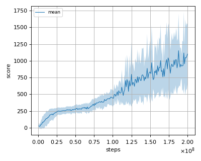
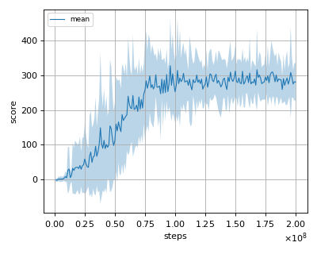

# TRPO (Trust Region Policy Optimization) with monte carlo estimate of values (single path procedure) reproduction

This reproduction script trains the TRPO (Trust Region Policy Optimization) algorithm proposed by J. Schulman et al. in the paper: [Trust Region Policy Optimization](https://arxiv.org/abs/1502.05477).

We tested our implementation with following MuJoCo environments using 3 different initial random seeds:

- HalfCheetah-v2
- Hopper-v2
- Walker2d-v2

## Result

We could not find appropriate score values to compare with in the [original paper](https://arxiv.org/pdf/1502.05477.pdf) for the tasks which we conducted.
We show here the comparison of scores with our implementation of [TRPO with GAE](../trpo/README.md)

|Env|TRPO with monte carlo estimate|TRPO with GAE|
|:---|:---:|:---:|
|HalfCheetah-v2|216.338+/-413.095|1734.41+/-445.055|
|Hopper-v2|1151.438+/-549.812|2348.019+/-1505.909|
|Walker2d-v2|327.199+/-134.622|3390.685+/-737.093|

## Learning curves

### HalfCheetah-v2

### Hopper-v2

### Walker2d-v2

