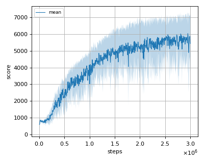
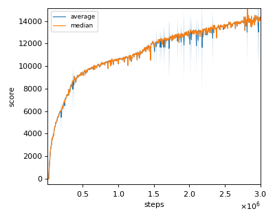
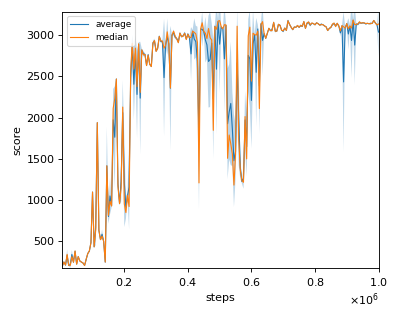
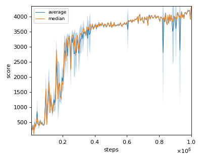

# ICML2018SAC (Soft Actor Critic with reward scaling) reproduction

We tested our implementation with 4 MuJoCo environments as in the [original paper](https://arxiv.org/pdf/1801.01290.pdf).

Following MuJoCo environments was tested with single seed:

- Ant-v2
- HalfCheetah-v2
- Hopper-v2
- Walker2d-v2

## Result

|Env|nnabla_rl best mean score|Reported score|
|:---|:---:|:---:|:---:|
|Ant-v2|6454.986+/-62.966|~6000|
|HalfCheetah-v2|15037.166+/-67.623|~15000|
|Hopper-v2|3180.067+/-14.983|~3300|
|Walker2d-v2|4296.147+/-22.963|~3800|

## Learning curves

### Ant-v2

### HalfCheetah-v2

### Hopper-v2

### Walker2d-v2

