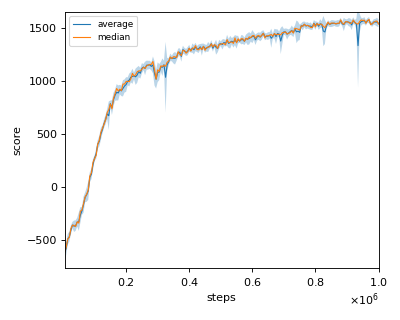
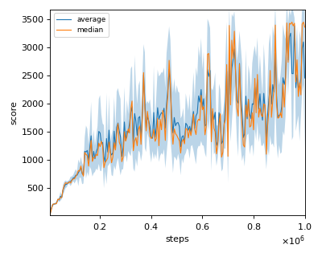
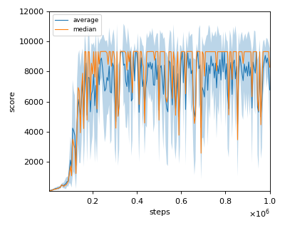
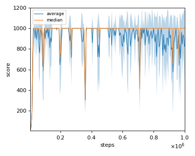
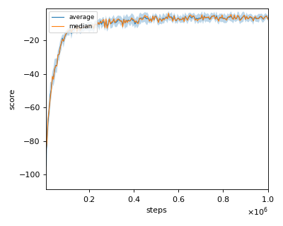
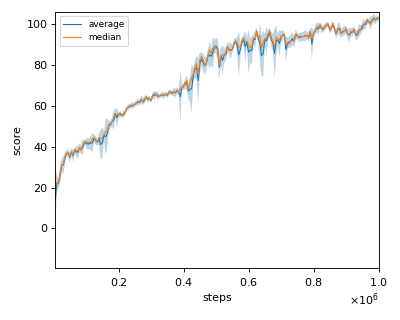
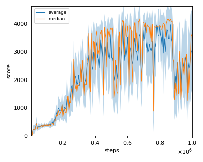

# PPO (Proximal Policy Optimization) reproduction

We tested our implementation with 7 MuJoCo environments as in the [original paper](https://arxiv.org/pdf/1707.06347.pdf).  

Following MuJoCo environments was tested with single seed:

- HalfCheetah-v2
- Hopper-v2
- InvertedDoublePendulum-v2
- InvertedPendulum-v2
- Reacher-v2
- Swimmer-v2
- Walker2d-v2

## Result

Reported score is rough estimate from the Figure 3 of the [original paper](https://arxiv.org/pdf/1707.06347.pdf).

|Env|nnabla_rl best mean score|Reported score|
|:---|:---:|:---:|:---:|
|HalfCheetah-v2|1576.38+/-29.05|~1800|
|Hopper-v2|3389.807+/-138.222|~2200|
|InvertedDoublePendulum-v2|9334.256+/-0.997|~8000|
|InvertedPendulum-v2|1000.0+/-0.0|~1000|
|Reacher-v2|-4.943+/-2.503|~-8|
|Swimmer-v2|103.008+/-2.211|~110|
|Walker2d-v2|4035.03+/-80.437|~3400|

## Learning curves

### HalfCheetah-v2

### Hopper-v2

### InvertedDoublePendulum-v2

### InvertedPendulum-v2

### Reacher-v2

### Swimmer-v2

### Walker2d-v2

