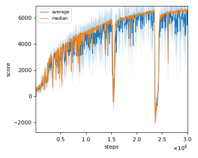
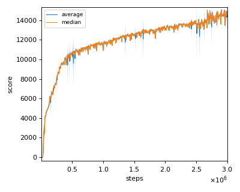
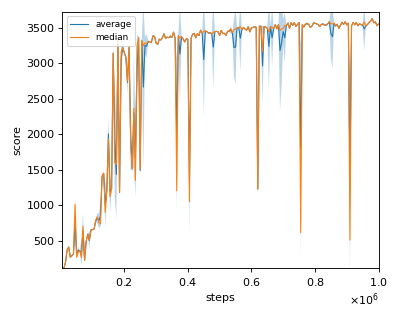
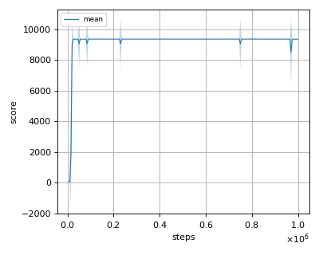
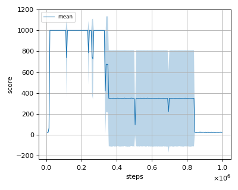
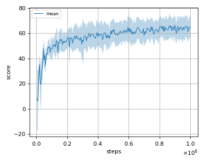
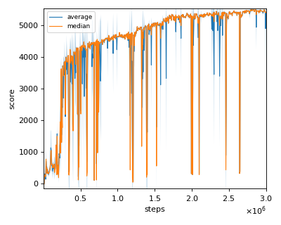

# SAC (Soft Actor Critic) reproduction

We tested our implementation with the following MuJoCo environments using 3 different initial random seeds:

This Soft Actor Critic algorithm's implementation adjusts the temperature parameter automatically.

- Ant-v2
- HalfCheetah-v2
- Hopper-v2
- InvertedDoublePendulum-v2
- InvertedPendulum-v2
- Reacher-v2
- Swimmer-v2
- Walker2d-v2

## Result

|Env|nnabla_rl best mean score|Reported score|
|:---|:---:|:---:|
|Ant-v2|6333.712+/-582.962|~5500|
|HalfCheetah-v2|15628.84+/-122.80|~15000|
|Hopper-v2|3572.477+/-22.762|~3300|
|InvertedDoublePendulum-v2|9359.66+/-0.27|N/A|
|InvertedPendulum-v2|1000.0+/-0.0|N/A|
|Reacher-v2|-2.98+/-1.42|N/A|
|Swimmer-v2|66.465+/-8.231|N/A|
|Walker2d-v2|5372.365+/-669.718|~6000|

## Learning curves

### Ant-v2

### HalfCheetah-v2

### Hopper-v2

### InvertedDoublePendulum-v2

### InvertedPendulum-v2

### Reacher-v2

### Swimmer-v2

### Walker2d-v2

