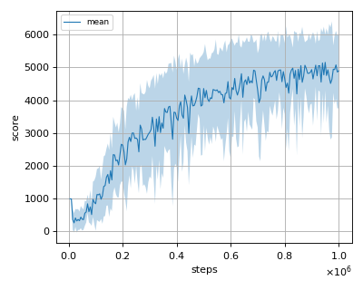
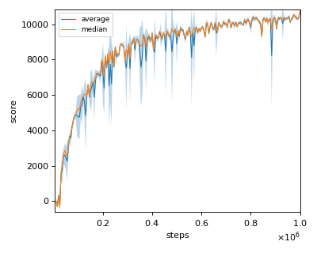
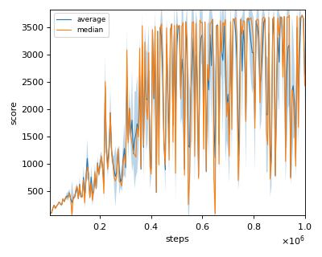
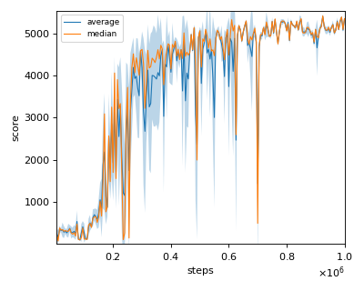

# TD3 (Twin Delayed Deep Deterministic policy gradient) reproduction

We tested our implementation with 4 MuJoCo environments also used in the [original paper](https://arxiv.org/pdf/1802.09477.pdf).

We tested our implementation with following MuJoCo environments using 3 different initial random seeds:

- Ant-v2
- HalfCheetah-v2
- Hopper-v2
- Walker2d-v2

## Result

|Env|nnabla_rl best mean score|Reported score|
|:---|:---:|:---:|
|Ant-v2|**5155.44+/-852.74**|4372.44+/-1000.33|
|HalfCheetah-v2|**9919.97+/-1173.35**|9636.95+/-859.065|
|Hopper-v2|3514.80+/-304.12|**3564.07+/-114.74**|
|Walker2d-v2|**4755.93+/-145.60**|4682.82+/-539.64|

## Learning curves

### Ant-v2

### HalfCheetah-v2

### Hopper-v2

### Walker2d-v2

