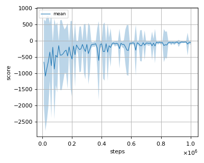
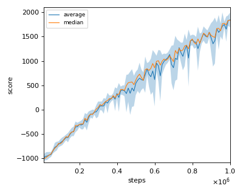
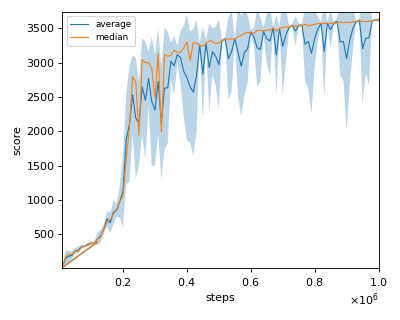
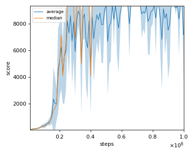
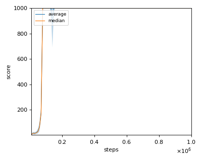
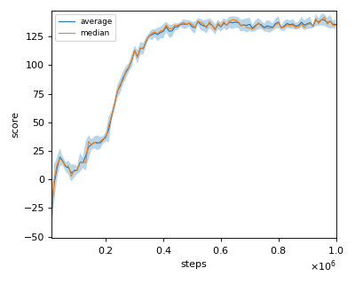
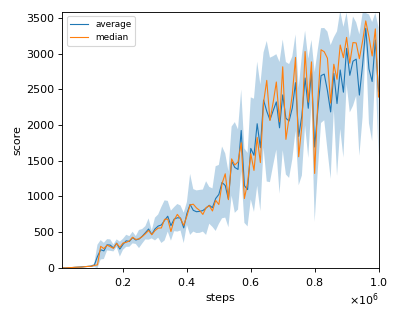

# TRPO (Trust Region Policy Optimization) with GAE (Generalized Advantage Estimation) reproduction

We tested our implementation with following MuJoCo environments using 3 different initial random seeds:

- Ant-v2
- HalfCheetah-v2
- Hopper-v2
- InvertedDoublePendulum-v2
- InvertedPendulum-v2
- Reacher-v2
- Swimmer-v2
- Walker2d-v2

## Result

Reported score is rough estimate from the Figure 3 of the [ppo paper](https://arxiv.org/pdf/1707.06347.pdf).

|Env|nnabla_rl best mean score|Reported score|
|:---|:---:|:---:|
|Ant-v2|-40.735+/-38.057|N/A|
|HalfCheetah-v2|1734.41+/-445.055|~0|
|Hopper-v2|2348.019+/-1505.909|~2100|
|InvertedDoublePendulum-v2|8993.567+/-1113.399|~0|
|InvertedPendulum-v2|1000+/-0|~1000|
|Reacher-v2|-5.011+/-1.337|~-110|
|Swimmer-v2|266.462+/-88.911|~120|
|Walker2d-v2|3390.685+/-737.093|~1050|

## Learning curves

### Ant-v2

### HalfCheetah-v2

### Hopper-v2

### InvertedDoublePendulum-v2

### InvertedPendulum-v2

### Reacher-v2

### Swimmer-v2

### Walker2d-v2

